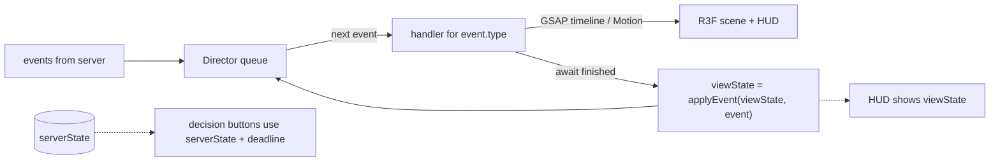

# Visual direction & animation

The PC game should feel like a **premium toy diorama**: a chunky, softly lit 3D board
filling the play viewport, pieces with weight and bounce, money that *flies*. A
sky-blue surround, a small living town in the center and an ivory track support
the original geometry.
Four compact player HUDs sit at the corners; only the current decision opens a
contextual action panel. Journal, proof, instructions and inspection tools stay
closed until requested. Every event the
server sends should have a satisfying, readable animation.

This document defines direction and planned animation budgets. Implemented and
verified behavior is recorded separately in [PLAYABLE_CHECKPOINT.md](PLAYABLE_CHECKPOINT.md).

## Art direction

- **Style:** stylized low-poly with soft gradients, baked ambient occlusion, rounded
  bevels. Think "collectible toy", not realism. Each country gets a distinct color
  and a signature landmark model.
- **Camera:** fixed isometric framing with an orthographic camera for the PC
  board, aimed from the Start corner: Start sits at the front and play leaves it
  to the left, clockwise on screen. Default view keeps all corners visible
  between the top tools and the bottom choice; any future action shot must
  return to that frame and preserve access to the current decision. Geometry
  lives in `client/scene/board-layout.ts` and its orientation is unit-tested.
- **Lighting:** one warm key light with soft shadows (or baked + `ContactShadows`),
  cool fill, environment map for subtle reflections on coins and landmarks.
- **Post:** ACES/AgX tone mapping, *selective* bloom (coins, landmarks, UI glows only),
  light vignette, SMAA. Bloom and shadows are the first things to drop on low tiers.
- **Player identity:** 4 colors chosen to be color-blind distinguishable, used on
  pawns, roofs, ownership flags, rents and corner HUDs. Color is the only player
  marker: no per-player symbols or icons.
- **UI:** compact ivory corner HUDs with bold tabular numerals and a discreet
  action area near the bottom center. Avoid permanent sidebars, oversized card
  grids and glass overlays that cover the board. Details open as dismissible
  popovers or dialogs. Money changes remain readable without growing the HUD.

## The Director (event → animation pipeline)

- `serverState` is always the truth; `viewState` lags behind it until animations finish.
  Both are advanced with the engine's shared reducer `applyEvent`: `serverState` as
  soon as an event arrives, `viewState` when its animation finishes.
- Scene handlers are `async (event, ctx) => void` and resolve within their shared
  `shared/board/timing.ts` budgets. The server includes those motion budgets in
  decision deadlines, including the chance card's reading hold, so a decision
  clock never runs during an animation. Continue and Escape can end the card early.
- **Bot pacing:** a bot acts only after the events that opened its decision have
  played at 1×, plus a short pause (`BOT_TIMING`: 0.7 s before a roll, 1.4 s
  before a choice). The engine's `botDecisionAt` derives that moment from the
  decision deadline, so the Durable Object never computes it, and a bot's turn
  reads like a player's instead of a burst of events.
- **Playback:** game-event animations play at their normal rate. The Director's
  per-event `playbackRate` applies only to automatic catch-up, through each GSAP
  timeline and the card reading hold. DOM panel transitions use fixed durations.
- **Catch-up:** one server action arrives as one batch and always plays at the
  normal rate, however many events it holds. Only a view two or more batches
  behind the server plays at 2.5×; beyond 40 queued events, or when the tab was
  hidden, it snaps straight to `serverState`.
- **Tab hidden:** `document.visibilitychange` → snap on return, don't queue minutes of animation.
- **Decision UI** appears only when the Director has drained the events that led to
  the decision — so the purchase panel never appears before the pawn lands.
  Identify the actual `pending.seat`, including off-turn forced payments, and
  keep tile name, owner, price and rent beside the available actions.
- **Forced sales** keep the board interactive. Eligible owned properties receive
  white faces, outlines and keyboard-accessible proceeds buttons projected onto
  their lots. Other lot faces and edges are dimmed during the choice. These
  temporary materials restore the ordinary board as soon as the sale ends.
  Clicking a lot or its quote selects it; the compact lower-center panel shows
  the debt, the chosen property's proceeds and the balance after settlement.
  No property is selected automatically, and a separate confirmation sends the
  sale intent. A new decision or reconnect snapshot clears the selection.

## Signature moments

| Event | Animation | Budget |
| --- | --- | --- |
| `DiceRolled` | Dice thrown from the player's side, tumble, bounce, settle on the server's values; camera micro-shake on impact; values pop above dice. Doubles: gold flash + "DOUBLE!" stamp. | 1.2 s |
| `PawnMoved` | Pawn hops tile-to-tile on an arc with squash & stretch (anticipation → hop → land squash). Each tile gives a small "press" and a soft tick sound whose pitch climbs. Camera follows with damped lerp. Teleports: pawn spins up into a light beam, lands with a ring shockwave. | 0.28 s / tile |
| `SalaryPaid` | Start tile flares; coins arc into the player's corner HUD; counter rolls up. | 0.8 s |
| `PropertyBought` | Ownership flag/tile border sweeps in the player's color; land plot "unfolds". | 0.7 s |
| `PropertyUpgraded` | Building rises out of the tile with overshoot (elastic ease), dust puff particles, a thunk + sparkle sound. | 0.9 s |
| Landmark | Slow-mo: camera pushes in, landmark rises, beam of light, confetti in owner color, choir hit. The most expensive moment — earn it. | 2.0 s |
| `RentPaid` | Coins burst from the payer's pawn, stream along a bezier to the owner's corner HUD. Coin count scales (log) with amount. Big rents: screen-edge red flash, heavier coin sound, both counters tick. | 1.0–1.6 s |
| `BoughtOut` | Owner's flag tears away, buyer's color sweeps into the tile; "SOLD!" stamp; the old owner's corner HUD reacts. | 1.2 s |
| `ChampionshipHosted` | Stadium lights sweep the board, spotlight locks on the host city, multiplier badge (×2, ×3…) slams onto it and stays floating. | 1.5 s |
| `CardDrawn` | Card flies out of the Chance deck, flips in 3D in front of the camera, holds for reading, then flies to its effect. | 1.4 s |
| `SentToIsland` | Pawn launched in an arc onto the Island corner; waves ripple; pawn gets a small life-ring. | 1.0 s |
| `MonopolyThreat` | Missing tiles pulse with a warning glow + a tense sting. | 1.0 s |
| `PlayerBankrupt` | Player's buildings crumble into particles, tiles fade to neutral, corner HUD marks bankruptcy while preserving player identity. | 1.8 s |
| `GameOver` | Winner's pawn and board remain visible; a compact standings overlay opens after the celebration. Expanded statistics are a separate optional view. | 4–6 s |

Rule of thumb: an ordinary turn (roll → move 7 tiles → pay rent) should read in
**≈ 4–5 s** at 1× (1.2 s dice + 7 × 0.28 s hops + 1.0–1.6 s rent ≈ 4.2–4.8 s).
Anything longer gets boring by round 10.

## Current construction feedback

The procedural prototype uses an owner-coloured ring and eight pooled geometric
sparks for purchase, upgrade and buyout events (1.1 seconds at 1×, after the
0.65 s cash flight). New houses, hotels and landmarks rise out of their plot one
after another with an overshoot; during that rise the instanced town draws the
next state for that one tile, and every other tile stays on `viewState`. The Director
owns the GSAP timeline; state recovery, reset and reduced motion cancel it and
hide its effects. A generation guard prevents a cancelled older handler from
hiding a newly started construction effect. Building bases, cornices and entrances are
instanced; hotels and terraced landmarks stay visually distinct. These are the
implemented construction accents, not the full sound/particle specification in
the signature-moment table above.

## Current town in the center

`client/scene/town-layout.ts` holds the town's geometry and
`client/scene/Downtown.tsx` draws it. Each city and resort has one plot in the
street facing its side, in play order. The plot mirrors `viewState`: an empty
outline while unsold, then the lot's level under the owner's color (a pool and parasol
for a resort). Plots, facades, roofs, windows and trees are instanced.

- **Construction:** the property handler that raises a lot's buildings also
  replays the town plot when its owner or level changes, with the same growth
  progress and overshoot, slightly delayed. A crane stands on the camera side of
  the plot and swings its jib during the rise. A buyout re-raises the plot in
  the buyer's color. Skip, reset and reduced motion snap it like the lot.
- **Ambient life:** seven cars circle the roundabout and visit every avenue's
  turning circle, the big wheel turns once every 40 s, the carousel spins with
  bobbing horses, a boat sails the pond, the helicopter hops off its pad every
  18 s and the four fountains pulse. Motion reads only the frame clock and
  never game state. Low graphics, reduced motion and the lobby previews keep it still.
- **Readability:** the plaza keeps the dice clear. An object may be no taller
  than its distance to the lawn edge behind it (`visibilityCap`), and the
  tallest building (0.68) stays under a die's top face. `town-layout.test.ts`
  projects every envelope through the camera against pawn spots, lot prints,
  the board road and the dice, and checks plots, trees and roads never overlap.
- **Cost:** about 56 more draw calls per frame including the shadow pass
  (295 against 239, measured with a WebGL hook in software rendering). Ambient
  life keeps the match canvas rendering at 30 fps between game animations
  instead of idling; Low graphics, reduced motion and lobby previews stay fully on demand.

## Current dice feedback

The dice take the roller's color, shake briefly on the roller's side of the
board, then fly high across the town, tumbling, and bounce to the server's values
on the central plaza. A small scoreboard then pops up with their total (gold for a
double) and holds long enough to read before the pawn sets off. The shake, throw
and reveal fit the shared 1.7 s dice budget. Pawns hop one tile per 0.3 s and
bounce on the last; a corner they only pass counts as a hop but is turned on the
road, never climbed. World Tour and card moves walk the same clockwise road, past
Start when their route crosses it; a move longer than twelve tiles hops faster and
lower so no walk takes more than 3.6 s, the longest dice walk. Reduced motion and
state recovery snap straight to the result.

## Current illustrated moments

Purchase, development and buyout dialogs use original isometric previews and
selectable stages, without explanatory sentences: the title, city, price, rent
and remaining cash say it. Every level up to the hotel is a card; a level this
player cannot take yet (the staged hotel, or one they cannot afford) stays
visible, greyed out with a padlock, and its reason is on hover. The dialogs
preserve the authoritative decision deadline and submit only the confirmed legal
action. Native dialogs protect keyboard focus; Escape minimizes a choice without
spending money.

Inspecting a space opens a large title-deed dialog over the board. It shows the
owner, the rent due there now, and the buyout price or purchase price. A table
gives the cost and rent of every building level, with the current one marked. A
city's festival or full-country bonus adds its own column. Resorts list their
rent by how many resorts the owner holds. Every figure comes from the shared
engine (`propertyRentAt`, `rentBoost`, `buyoutPrice`), never from UI arithmetic.
Every space opens at the same size, so the step arrows stay under the pointer.
Escape, the close button or a backdrop click closes it.

The Director now has a separate DOM presenter alongside its scene animator.
`CardDrawn` waits for a bounded illustrated reading moment (the 3.2 s card
budget, divided by the automatic catch-up playback rate) before the subsequent
effects play. Continue and Escape resolve that moment; state recovery, snapshot
replacement and reconnect cancel it. This reading hold uses the existing
decision clock and does not extend a server deadline. Reduced motion keeps a
static card and its instructions. Card art and prompts are documented in
[CARD_ART.md](CARD_ART.md).

Four capped banknote reserves and coin piles sit just outside the track. Repeated
note faces, straps and coin details are instanced. Salary, rent, transfers,
purchases, building, buyouts and sales animate a pooled bundle along the actual
payer/recipient path, using the existing 200 ms money or 450 ms property budget.
Cancelled timelines cannot hide a later effect. Static reserves follow view
state; the DOM HUD remains the exact cash display.

## Dice: deterministic result, physical feel

The server decides the dice. The client must *show* those exact values.

- **Phase 3 (ship first): keyframed throw.** GSAP timeline: arc + random spin that
  ends in the quaternion showing the target face, with 2–3 bounces via a custom
  bounce ease. Fast to build, fully controllable, looks good with contact shadows.
- **Phase 5 (upgrade): physics with face remapping.** On `DiceRolled`, run a
  headless Rapier simulation of a random throw to rest (a few ms), **recording each
  die's transform at every step**, and read which face ended up on top. Then rotate
  the die's *visual mesh* relative to its rigid body so that face shows the server
  value, and play the recorded frames back. Play back the recording rather than
  re-simulating, so the visible throw is guaranteed to match the one that was
  measured. Real physics, guaranteed result. Rapier is lazy-loaded only when the
  scene is.

## Motion language

| Purpose | System | Ease | Duration |
| --- | --- | --- | --- |
| Things appearing (buildings, cards) | GSAP | `back.out(1.7)` / `elastic.out(1, 0.5)` | 0.4–0.7 s |
| Things leaving | GSAP | `power2.in` | 0.2–0.3 s |
| Camera moves | GSAP | `power3.inOut` (or `expo.inOut` for big pushes) | 0.6–1.2 s |
| Pawn hops | GSAP | custom hop ease; squash 0.85/1.15 on land | 0.28 s |
| HUD money counters | Motion (`animate()`) | `easeOut`, duration scales with log(amount) | 0.4–1.0 s |
| UI panels | Motion | spring, `stiffness 400, damping 30` | — |

Game-event budgets are at 1× and divide by the Director's per-event `playbackRate`
only during automatic catch-up. UI transitions keep their normal durations.

Consistency matters more than any single animation: reuse these presets from
`client/director/easings.ts`, don't invent per-component curves.

## Sound (half of the "feel")

- Every animation has a sound; every sound has a small random pitch variation (±5%).
- Layers: UI clicks, dice (roll + impacts), footsteps/ticks (rising pitch per tile),
  coins (small/medium/huge variants), building thunks, stingers (double, monopoly
  threat, landmark, bankrupt, victory), and a looping music bed that ducks under stingers.
- Mix bus: master / music / SFX sliders, persisted in `localStorage`.
- A future mobile adaptation must unlock the AudioContext on its first touch;
  this is not a PC prototype gate.

## Performance rules for the scene

- Tiles, houses, coins, and particles are **instanced**. Target < 150 draw calls.
- Never allocate in `useFrame`; keep temp `Vector3`/`Quaternion` objects module-level.
- `frameloop="demand"`; call `invalidate()` from GSAP's `onUpdate`. The town's
  ambient life adds a capped 30 fps `invalidate()` loop to the match board;
  Low graphics, reduced motion and lobby previews skip it and render only on demand.
- The prototype's optional **Low graphics** setting uses DPR 1 and disables live
  shadows and pauses decorative town and selection motion. Game-event animations
  remain enabled. High keeps DPR ≤ 1.5 and a 2048² shadow map. The compact monitor
  button shows High/Low and switches in one click before joining and in the match
  toolbar; View and animation shows the same saved local preference. See
  [PERFORMANCE.md](PERFORMANCE.md) for the software-rendering comparison and limits.
- Particles: one pooled `InstancedMesh` per particle type, recycled.
- Text in 3D (multiplier badges, floating numbers): drei `<Text>` with a pre-generated
  SDF font, or HTML overlays via drei `<Html>` sparingly (they're DOM nodes).
- Planned quality tiers (auto via `PerformanceMonitor`, override in settings):

| Tier | DPR | Shadows | Bloom | Particles | MSAA/SMAA |
| --- | --- | --- | --- | --- | --- |
| Low | 1 | baked only | off | 30% | off |
| Medium | ≤ 1.5 | contact shadows | selective, half-res | 60% | SMAA |
| High | ≤ 2 | soft shadow map | selective, full-res | 100% | SMAA |

## Accessibility

- `prefers-reduced-motion`: no camera shake, no slow-mo, camera cuts instead of
  sweeps, particles at 30%, but keep money flow animations (they carry information).
- Every color-coded thing also has an icon or pattern.
- All decisions reachable by keyboard; essential HUD text ≥ 14 px at 1280×720; numbers have
  sufficient contrast over the 3D scene (panel backgrounds, not raw text on the board).
- Validate the whole board, corner HUDs, contextual choices and dismissible tools
  at 1280×720, 1440×900 and 1920×1080. Preserve reduced motion and keyboard focus.
  Mobile remains best effort; physical phone FPS is not an acceptance criterion.

## References to study (for feel, not assets)

Business Tour and Modoo Marble / "Let's Get Rich" for pacing and win-condition drama;
Monopoly GO! for money/dice juice; Mario Party for board-camera choreography;
the "Juice it or lose it" talk (Jonasson & Purho) for feedback layering.
