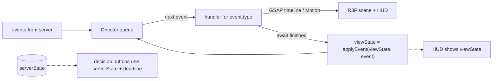

# Visual direction & animation

The game should feel like a **premium toy diorama**: a chunky, softly lit 3D board
on a table, pieces with weight and bounce, money that *flies*. Every event the
server sends should have a satisfying, readable, skippable animation.

## Art direction

- **Style:** stylized low-poly with soft gradients, baked ambient occlusion, rounded
  bevels. Think "collectible toy", not realism. Each country gets a distinct color
  and a signature landmark model.
- **Camera:** perspective, ~45° tilt, slightly low FOV (30–35°) for a miniature feel.
  Default view frames the whole board; action shots dolly toward the active pawn.
- **Lighting:** one warm key light with soft shadows (or baked + `ContactShadows`),
  cool fill, environment map for subtle reflections on coins and landmarks.
- **Post:** ACES/AgX tone mapping, *selective* bloom (coins, landmarks, UI glows only),
  light vignette, SMAA. Bloom and shadows are the first things to drop on low tiers.
- **Player identity:** 4 colors chosen to be color-blind distinguishable, each with a
  pattern/icon too, used on pawns, ownership flags, tile borders, and HUD cards.
- **UI:** big rounded cards, bold numerals (tabular figures), glassy panels over the
  3D scene, one accent gradient. All HUD money values count up/down, never jump.

## The Director (event → animation pipeline)

- `serverState` is always the truth; `viewState` lags behind it until animations finish.
  Both are advanced with the engine's shared reducer `applyEvent`: `serverState` as
  soon as an event arrives, `viewState` when its animation finishes.
- Each handler is `async (event, ctx) => void` and must resolve within its budget.
  Budgets live in `shared/board/timing.ts`, the same config the server uses for
  `animationBudget`, so decision deadlines always cover the animation.
- **Speed:** a Director `speed` (1×, 1.5×, 2×) is applied to GSAP's global timeline
  (`gsap.globalTimeline.timeScale(speed)`) **and** to DOM animation: Motion has no
  global clock, so HUD transitions and money counters read `speed` from the Director
  store and divide their durations by it. Otherwise the HUD lags behind the scene at 2×.
- **Catch-up:** if the queue holds more than ~6 events (reconnect, tab was hidden),
  play at 3× and skip camera moves; if > 30, snap straight to `serverState`.
- **Tab hidden:** `document.visibilitychange` → snap on return, don't queue minutes of animation.
- **Decision UI** appears only when the Director has drained the events that led to
  the decision — so the "Buy?" card never pops up before the pawn lands.

## Signature moments

| Event | Animation | Budget |
| --- | --- | --- |
| `DiceRolled` | Dice thrown from the player's side, tumble, bounce, settle on the server's values; camera micro-shake on impact; values pop above dice. Doubles: gold flash + "DOUBLE!" stamp. | 1.2 s |
| `PawnMoved` | Pawn hops tile-to-tile on an arc with squash & stretch (anticipation → hop → land squash). Each tile gives a small "press" and a soft tick sound whose pitch climbs. Camera follows with damped lerp. Teleports: pawn spins up into a light beam, lands with a ring shockwave. | 0.28 s / tile |
| `SalaryPaid` | Start tile flares; coins arc into the player's HUD card; counter rolls up. | 0.8 s |
| `PropertyBought` | Ownership flag/tile border sweeps in the player's color; land plot "unfolds". | 0.7 s |
| `PropertyUpgraded` | Building rises out of the tile with overshoot (elastic ease), dust puff particles, a thunk + sparkle sound. | 0.9 s |
| Landmark | Slow-mo: camera pushes in, landmark rises, beam of light, confetti in owner color, choir hit. The most expensive moment — earn it. | 2.0 s |
| `RentPaid` | Coins burst from the payer's pawn, stream along a bezier to the owner's HUD card. Coin count scales (log) with amount. Big rents: screen-edge red flash, heavier coin sound, both counters tick. | 1.0–1.6 s |
| `BoughtOut` | Owner's flag tears away, buyer's color floods in from the tile edges; "SOLD!" stamp; the old owner's HUD card shakes. | 1.2 s |
| `ChampionshipHosted` | Stadium lights sweep the board, spotlight locks on the host city, multiplier badge (×2, ×3…) slams onto it and stays floating. | 1.5 s |
| `CardDrawn` | Card flies out of the Chance deck, flips in 3D in front of the camera, holds for reading, then flies to its effect. | 1.4 s |
| `SentToIsland` | Pawn launched in an arc onto the Island corner; waves ripple; pawn gets a small life-ring. | 1.0 s |
| `MonopolyThreat` | Missing tiles pulse with a warning glow + a tense sting. | 1.0 s |
| `PlayerBankrupt` | Player's buildings crumble into particles, tiles fade to neutral, HUD card greys out and slides away. | 1.8 s |
| `GameOver` | Board-orbit camera, winner's pawn on a pedestal, confetti, stat cards slide in (net worth graph over time, biggest rent, most buyouts). | 4–6 s |

Rule of thumb: an ordinary turn (roll → move 7 tiles → pay rent) should read in
**≈ 4–5 s** at 1× (1.2 s dice + 7 × 0.28 s hops + 1.0–1.6 s rent ≈ 4.2–4.8 s).
Anything longer gets boring by round 10.

## Dice: deterministic result, physical feel

The server decides the dice. The client must *show* those exact values.

- **Phase 3 (ship first): keyframed throw.** GSAP timeline: arc + random spin that
  ends in the quaternion showing the target face, with 2–3 bounces via a custom
  bounce ease. Fast to build, fully controllable, looks good with contact shadows.
- **Phase 5 (upgrade): physics with face remapping.** On `DiceRolled`, run a
  headless Rapier simulation of a random throw to rest (a few ms), **recording each
  die's transform at every step**, and read which face ended up on top. Then rotate
  the die's *visual mesh* relative to its rigid body so that face shows the server
  value, and play the recorded frames back. Play back the recording rather than
  re-simulating, so the visible throw is guaranteed to match the one that was
  measured. Real physics, guaranteed result. Rapier is lazy-loaded only when the
  scene is.

## Motion language

| Purpose | System | Ease | Duration |
| --- | --- | --- | --- |
| Things appearing (buildings, cards) | GSAP | `back.out(1.7)` / `elastic.out(1, 0.5)` | 0.4–0.7 s |
| Things leaving | GSAP | `power2.in` | 0.2–0.3 s |
| Camera moves | GSAP | `power3.inOut` (or `expo.inOut` for big pushes) | 0.6–1.2 s |
| Pawn hops | GSAP | custom hop ease; squash 0.85/1.15 on land | 0.28 s |
| HUD money counters | Motion (`animate()`) | `easeOut`, duration scales with log(amount) | 0.4–1.0 s |
| UI panels | Motion | spring, `stiffness 400, damping 30` | — |

All durations are at 1× and are divided by the Director's `speed`.

Consistency matters more than any single animation: reuse these presets from
`client/director/easings.ts`, don't invent per-component curves.

## Sound (half of the "feel")

- Every animation has a sound; every sound has a small random pitch variation (±5%).
- Layers: UI clicks, dice (roll + impacts), footsteps/ticks (rising pitch per tile),
  coins (small/medium/huge variants), building thunks, stingers (double, monopoly
  threat, landmark, bankrupt, victory), and a looping music bed that ducks under stingers.
- Mix bus: master / music / SFX sliders, persisted in `localStorage`.
- Mobile: unlock the AudioContext on the first tap (Howler handles this).

## Performance rules for the scene

- Tiles, houses, coins, and particles are **instanced**. Target < 150 draw calls.
- Never allocate in `useFrame`; keep temp `Vector3`/`Quaternion` objects module-level.
- `frameloop="demand"` when nothing is animating (Director idle + no camera input);
  call `invalidate()` from GSAP's `onUpdate`. Saves battery on phones.
- Particles: one pooled `InstancedMesh` per particle type, recycled.
- Text in 3D (multiplier badges, floating numbers): drei `<Text>` with a pre-generated
  SDF font, or HTML overlays via drei `<Html>` sparingly (they're DOM nodes).
- Quality tiers (auto via `PerformanceMonitor`, override in settings):

| Tier | DPR | Shadows | Bloom | Particles | MSAA/SMAA |
| --- | --- | --- | --- | --- | --- |
| Low | 1 | baked only | off | 30% | off |
| Medium | ≤ 1.5 | contact shadows | selective, half-res | 60% | SMAA |
| High | ≤ 2 | soft shadow map | selective, full-res | 100% | SMAA |

## Accessibility

- `prefers-reduced-motion`: no camera shake, no slow-mo, camera cuts instead of
  sweeps, particles at 30%, but keep money flow animations (they carry information).
- Every color-coded thing also has an icon or pattern.
- All decisions reachable by keyboard; HUD text ≥ 14 px on phones; numbers have
  sufficient contrast over the 3D scene (panel backgrounds, not raw text on the board).

## References to study (for feel, not assets)

Business Tour and Modoo Marble / "Let's Get Rich" for pacing and win-condition drama;
Monopoly GO! for money/dice juice; Mario Party for board-camera choreography;
the "Juice it or lose it" talk (Jonasson & Purho) for feedback layering.
