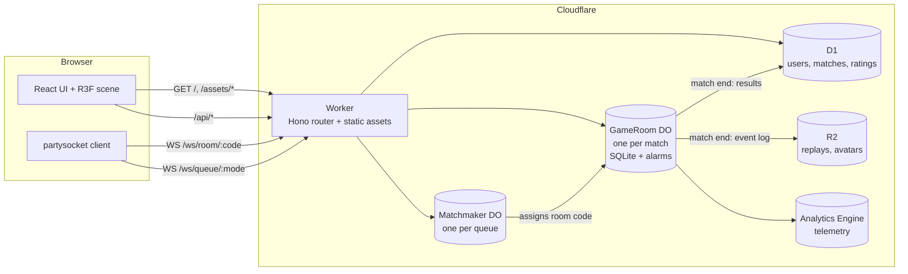
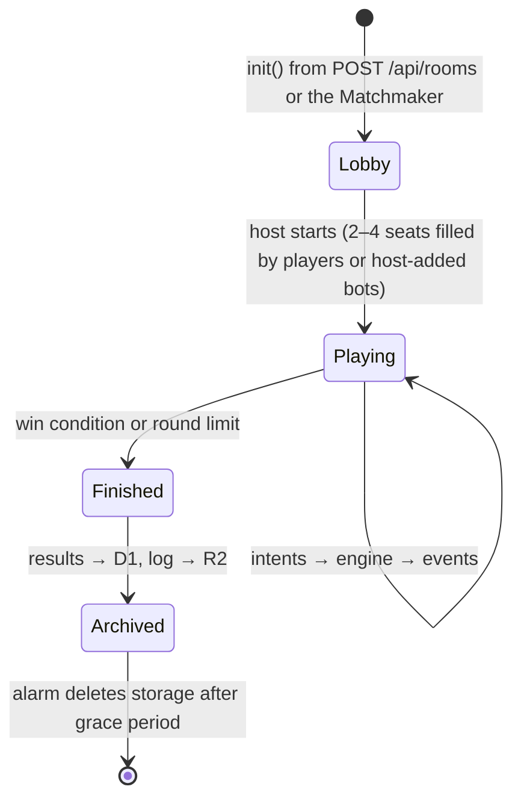
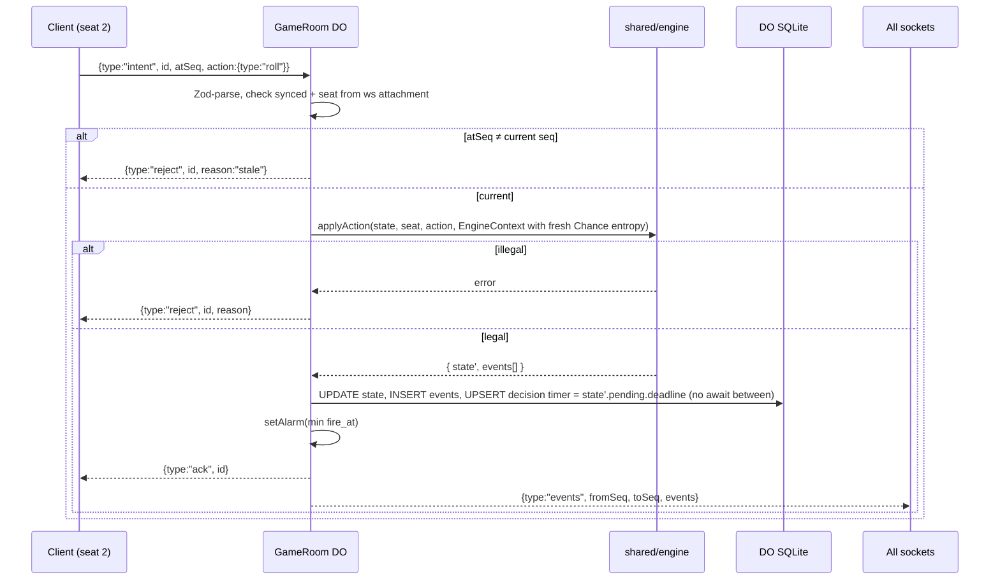

# Architecture

## Implemented prototype boundary

The first playable slice uses a Worker and one SQLite-backed GameRoom per private
room of two to four seats. A room outlives its matches: its leader can return
everyone to the lobby and start again. It stores state, events, proof receipts, commands and timers in
that room. Create/join issues a cryptographically random seat capability; only its
hash is stored. The WebSocket sends the token in `Sec-WebSocket-Protocol`, never
the URL. The client keeps it in sessionStorage, so refresh restores its seat in
that browser session. Accounts, Turnstile, signed cookies, D1 results and R2 replay
archives below remain the planned launch architecture rather than implemented auth.

`POST /api/rooms` first uses the `ROOM_CREATION_RATE_LIMIT` binding with the fixed
server key `room-creation`: 120 requests per minute per Cloudflare location. After
Origin/body validation, the existing Matchmaker named `room-admission` atomically
enforces a burst of 60, refill of one admission per second, and at most 1,000
admissions per UTC day. It persists one `room-creation-budget` record, independent
of caller IPs, cookies and headers. An admission is spent on the creation attempt,
even if room initialization later fails; collision retries share that admission.
These gates do not apply to joins, reconnects or gameplay. Denials return JSON 429
with `Retry-After` and `Cache-Control: no-store`; gate failures return JSON 503.
Health endpoints answer in the Worker without looking up any Durable Object.
The edge limit is location-local and eventually consistent; the durable budget
constrains allocation across locations. Neither guarantees complete DDoS resistance
or fair admission: abusive callers can exhaust the shared budget. See
[CLOUDFLARE_OPERATIONS.md](CLOUDFLARE_OPERATIONS.md#room-allocation-controls).

Besides `seats`, the room stores a `members` table (people waiting for a place:
an approval, a bot's seat or the next game, each with a capability hash) and a
`local_seats` table (players sharing a device with a controller seat; they have no
token of their own). `meta` holds the leader seat (`host`, default 0 for older
rooms) and the `locked` flag. Both tables are created with the room; a room
saved before them gains them with `IF NOT EXISTS` when it next wakes (unknown
rooms still allocate nothing), so saved rooms need no state migration. Sockets are matched to seats and
members through their attachments rather than tags, so a waiting member's socket
stays open when that person takes a place. Spectating members do not count as an
audience: with only them connected, the room sleeps like an abandoned match.

Explicit departure uses a capability-authenticated HTTP request, even while the
socket reconnects. In a lobby it releases the device's own and local places,
revokes its capability, closes all its sockets and transfers the persisted leader
to another person with their own device. Waiting members may leave too. Released
places admit connected, approved members; with no devices left, the room unlocks
and its next seated person becomes leader. Ordinary socket disconnection keeps
places and leadership for recovery. During a match, departure closes the device's
sockets but preserves its places, match state and usual reconnect grace.

Persisted alarms drive bots, decision deadlines, disconnect grace, real-time match
expiry. New-room rolls resolve immediately through server Web Crypto, without a
network fetch. Legacy drand-round alarms remain supported: a saved commitment
survives retry/reconnect and keeps its original source. See [RANDOMNESS.md](RANDOMNESS.md).
Live Chance draws receive fresh Web Crypto through `EngineContext.chanceEntropy`
and select uniformly among remaining cards with rejection sampling, without
replacement. This is independent of seeded setup and applies to saved decks without
a state schema or rules-version bump; seeded draws remain a simulation fallback.
When no player socket remains open, the room stops bot moves, decision alarms
and entropy retries. It retains the real match deadline and each disconnect grace
timer, then expires normally; reconnect restores the pending work without moving
either deadline. Clock sync reads no SQL, unchanged timers are not rewritten and
an unchanged platform alarm is not reset. See [CLOUDFLARE_OPERATIONS.md](CLOUDFLARE_OPERATIONS.md)
for the write-quota incident and measured regressions.
State version 1 is retained, with the explicit migration ladder from PR #19.
New rooms freeze rules version 6: country-grouped board, reference economy,
staged hotels and World Tour flights to free or own properties. Version-5 rooms
keep flights to own properties only when none is free.
Existing version-2/3 rooms retain the original board, prototype
prices, travel and sale rules; version 2 also keeps its original hotel progression.
The competing unshipped version-4 definitions are not silently guessed. Unknown
or contradictory saved markers are rejected before a room can change rules.

The React client lazy-loads the Three.js/R3F board and uses a Director to advance
the rendered state separately from authoritative state. Original procedural
geometry avoids an external asset dependency. No production deploy is implied by
local verification.

Polytour is one Cloudflare Worker that serves the web client, an HTTP API, and
WebSocket upgrades. Each live match is a `GameRoom` Durable Object: a single-threaded,
strongly consistent actor that owns the game state, the players' sockets, and the
turn timers. Everything that outlives a match (accounts, results, ratings) goes to D1.

## Public HTML and crawl routing

The Worker serves crawlable homepage HTML with a fixed production canonical URL,
social metadata, game structured data and content available before React starts.
Only `https://polytour.fun` advertises an indexable homepage and sitemap. Private
room/invitation HTML and nonproduction Worker responses carry HTTP noindex
directives. The asset handler serves existing static files; missing files and
unknown navigation paths receive a real 404. See [SEO.md](SEO.md) for the locale,
favicon, share-image and crawler policy.

## Browser diagnostics

The match HUD measures the full HTTP round trip to the same-origin static asset
`GET /connection-probe.txt`, without browser caching, every five seconds while
the match is connected, the browser page is visible and the browser is online. Only
one request can be pending; a five-second timeout releases it even if the
transport never settles after cancellation. Browser connectivity changes,
game reconnects and returning to a visible page immediately restart measurement,
discarding superseded responses. Commit-phase teardown removes timers and listeners
and aborts pending work. A small bottom-right `AMS · 42 ms` indicator and the
Debug tab share this stream; closing Debug leaves the static HUD probe running.
Leaving the match stops it. The probe validates its complete sentinel
body before accepting a sample, so an SPA fallback cannot look like a successful
measurement. The response's `Cf-Ray` suffix identifies the current Cloudflare
entry point, and its URL identifies the contacted hostname, including a branch
Preview. Its readable location and broad region
come from a bundled snapshot of the [official Cloudflare Status components
API](https://www.cloudflarestatus.com/api/v2/components.json), retrieved on
3 October 2026 (`shared/protocol/cloudflare-locations.ts`). Updating that snapshot means
joining POP components' `group_id` to the seven geographic region groups and
extracting the final three-letter code from each POP name. Product components
are excluded. The snapshot contains 341 POPs; new codes still display when unmapped.

Without `Cf-Ray`, loopback hosts show local execution. Missing POP metadata stays
unknown. Visitor
`cf.city`, `cf.country` and `cf.region` are never used as a server location.
The HTTP ping is separate from the WebSocket game latency, and this entry point
does not identify the game socket's entry point or the room's Durable Object location.
With `assets.run_worker_first` limited to `/api/*` and `/ws/*`, the probe is served
directly by Workers Static Assets without invoking Worker JavaScript or a Durable
Object. It remains a network request; static asset requests are free and unlimited
under this configuration. The existing `/api/health?debug=1` endpoint remains
available for on-demand operational checks and is not called by the browser ping.
See Cloudflare's [response headers](https://developers.cloudflare.com/fundamentals/reference/http-headers/#cf-ray),
[static asset billing](https://developers.cloudflare.com/workers/static-assets/billing-and-limitations/)
and [DO location](https://developers.cloudflare.com/durable-objects/reference/data-location/).

The same Debug view also measures the existing game WebSocket's round trip every
five seconds, after the server advertises the optional debug capability in
`welcome`. A fixed `setWebSocketAutoResponse` pair responds without waking
hibernating game JavaScript, touching SQLite or scheduling a DO alarm. A bounded
per-socket FIFO keeps expired attempts across menu/visibility changes so late
constant replies cannot produce a false fresh latency. Closing Debug stops the
room-diagnostic timers. At this cadence, 720 incoming messages per hour correspond to
36 DO compute-request equivalents per hour per active debugger under the
[20:1 WebSocket billing ratio](https://developers.cloudflare.com/durable-objects/platform/pricing/#compute-billing).
Outgoing messages are free; these pings add no Worker HTTP requests. They are not
entirely unmetered DO messages.

One authenticated `debug-info` message on open/reconnect obtains a routing snapshot
from WebSocket attachments: the current socket's public Worker endpoint/ingress,
and each connected seat's ingress POP. The diagnostic handler reads no game SQL
rows. Metadata requests can wake the DO; its constructor only checks for an
existing schema. They expose no IP addresses, seat capabilities, object identifiers
or database contents. This metadata is sent
only to the requesting room member. It is refreshed after reconnection or when an
initial measurement was interrupted, without continuous metadata polling.

The Debug view also lists the bank's totals (paid to players, received from
players and the account balance, which starts at 0). They come from the public
match state the client already holds, so they add no traffic. State version 2
added the gross totals; a version-1 save climbs with the net ledger booked on one
side.

The route diagram joins those player entry points to one shared `GameRoom` with
its local SQLite database. A DO's exact execution POP and physical server hostname
have no documented runtime getters; their unhelpful placeholder rows are omitted
from the UI, along with the jurisdiction row.
`ctx.id.jurisdiction` is an enforced restriction, not the execution DC, and is null
for the current unrestricted rooms. `request.cf.colo` is ingress metadata and must
never be substituted for a DO's location. HTTP and WebSocket round trips are
shown separately; subtracting them would not reliably measure Worker-to-DO latency.

## System overview



## Cloudflare products and why

| Product | Role in Polytour | Why this one |
| --- | --- | --- |
| **Workers + Static Assets** | Serves the SPA, `/api/*`, and WS upgrades. One deploy. | Static files use direct asset serving; app documents use the Worker for canonical and crawl headers. Missing paths return 404. |
| **Durable Objects (SQLite)** | `GameRoom` per match, `Matchmaker` per queue. | Exactly the "coordination atom" pattern: single-threaded, strongly consistent state + WebSockets in one place. |
| **DO WebSocket Hibernation** | All player connections. | Turn-based games are idle most of the time; hibernation keeps sockets open while the DO is evicted, so idle rooms cost almost nothing. |
| **DO Alarms** | Turn deadlines, disconnect grace, bot moves, room cleanup. | Durable timers that survive eviction; `setTimeout` would pin the DO in memory. |
| **D1** | Users, match history, ratings, cosmetics/inventory. | Relational queries across matches (leaderboards, profile history). |
| **R2** | Compressed match event logs (replays), user avatars, oversized assets. | Cheap blob storage, no egress fees. |
| **Analytics Engine** | Game telemetry: turn durations, abandon rate, money curves, win condition distribution. | High-cardinality events written straight from the DO; queryable with SQL for balancing. |
| **Turnstile** | Guest account creation and room creation. | Stops bot farms without CAPTCHAs for real users. |
| **Workers Rate Limiting binding** | `/api/*` and WS connect attempts. | Cheap abuse control at the edge. |

Not needed at launch: KV (no read-heavy global config yet), Queues (post-match work
fits in the DO's alarm), Workflows, Workers AI (bots are heuristic and run in the DO).
Add them only when a concrete requirement appears.

## Routing

`wrangler.jsonc` (routing excerpt; Analytics Engine remains planned):

```jsonc
{
  "$schema": "./node_modules/wrangler/config-schema.json",
  "name": "polytour",
  "main": "./src/worker/index.ts",
  "compatibility_date": "2026-09-30",
  "assets": {
    "binding": "ASSETS",
    "not_found_handling": "none",
    "run_worker_first": ["/", "/index.html", "/robots.txt", "/sitemap.xml", "/rooms/*", "/api/*", "/ws/*"]
  },
  "durable_objects": {
    "bindings": [
      { "name": "GAME_ROOM", "class_name": "GameRoom" },
      { "name": "MATCHMAKER", "class_name": "Matchmaker" }
    ]
  },
  "migrations": [{ "tag": "v1", "new_sqlite_classes": ["GameRoom", "Matchmaker"] }],
  "d1_databases": [{ "binding": "DB", "database_name": "polytour", "database_id": "<id>" }],
  "r2_buckets": [{ "binding": "REPLAYS", "bucket_name": "polytour-replays" }],
  "analytics_engine_datasets": [{ "binding": "TELEMETRY", "dataset": "polytour_events" }],
  "observability": { "enabled": true }
}
```

| Route | Handler |
| --- | --- |
| `GET /`, `/rooms/:roomCode` | Worker serves app HTML with canonical and crawl headers |
| `GET /robots.txt`, `/sitemap.xml` | Worker applies the production-origin crawl policy |
| `GET /index.html` | Permanent redirect to `/`, preserving the query |
| `GET /*` (existing static file) | Static assets (Worker not invoked); unknown paths return 404 |
| `POST /api/auth/guest` | Verify Turnstile, create guest user in D1, set signed session cookie |
| `GET /api/me` | Current user profile |
| `POST /api/rooms` | Create private room: generate a 6-char code, call `GAME_ROOM.getByName(code).init()`; on "already initialized", retry with a new code → returns the code |
| `GET /api/leaderboard` | Top ratings from D1 (cache with Workers Cache) |
| `GET /api/matches/:id/replay` | Stream event log from R2 |
| `GET /ws/room/:code` | Check `Origin`, authenticate cookie → `env.GAME_ROOM.getByName(code).fetch(req)` |
| `GET /ws/queue/:mode` | Check `Origin`, authenticate → `env.MATCHMAKER.getByName(mode).fetch(req)` |

The Worker authenticates **before** forwarding a WS upgrade and passes the verified
`userId` to the DO in a header it sets itself (strip any incoming copy of that header first).
It also rejects upgrades whose `Origin` header is not one of our own origins (403);
browsers don't apply CORS to WebSockets, so this is the defense against cross-site
WebSocket hijacking on top of `SameSite=Lax`.

## GameRoom Durable Object

### Lifecycle



Connecting never creates a room. A WebSocket upgrade for a code whose DO has not
been initialized (never created, or already cleaned up) is rejected, so guessing
codes can't create room tables. The constructor only checks whether the `meta`
table exists; schema creation is deferred solely to `init()`. Unknown lookups,
joins and upgrades write no room schema. Cleanup deletes storage without recreating
tables; later socket callbacks, alarms and lookups retain that empty state.
`init()` refuses to run twice, which also turns a room-code collision into a retry
with a fresh code.

### Storage (DO SQLite)

```sql
CREATE TABLE IF NOT EXISTS meta    (k TEXT PRIMARY KEY, v TEXT NOT NULL);         -- phase, roomCode, createdAt, config
CREATE TABLE IF NOT EXISTS seats   (seat INTEGER PRIMARY KEY, user_id TEXT, is_bot INTEGER);
CREATE TABLE IF NOT EXISTS state   (id INTEGER PRIMARY KEY CHECK (id = 1), seq INTEGER NOT NULL, json TEXT NOT NULL);
CREATE TABLE IF NOT EXISTS events  (seq INTEGER PRIMARY KEY, json TEXT NOT NULL); -- append-only log
CREATE TABLE IF NOT EXISTS timers  (kind TEXT PRIMARY KEY, fire_at INTEGER NOT NULL, payload TEXT);
```

- `state` holds the full engine state (including PRNG state) as of `seq`.
- `events` is the append-only log. It powers reconnect catch-up and replays.
- Presence is **not** stored: a seat is online iff `ctx.getWebSockets("seat:<n>")`
  returns an open socket. A persisted `connected` flag would go stale whenever the
  runtime drops sockets without a close handler running (e.g. a deploy restart).
- `timers` works around "one alarm per DO": after any change, set the alarm to
  `MIN(fire_at)`. The `alarm()` handler processes every due timer, then re-arms.

### Handling an intent



Per-player redaction: events are broadcast identically to everyone *unless* an
event carries private data (none planned in v1 - card draws are public). If hidden
info is added later, redact per socket using the seat in the attachment.

### Timers and disconnects

| Timer | Fires | Effect |
| --- | --- | --- |
| `decision` | `state.pending.deadline` (computed by the engine) | `applyTimeout` applies the rule-defined default for a human seat (auto-roll, decline purchase, auto-sell cheapest to cover debt). |
| `grace:<seat>` | 60 s after socket close | Seat becomes a bot seat (`botAction`, medium) until the player reconnects. |
| `bot` | `botDecisionAt`: once the events that opened the decision have played at 1×, plus 0.7 s (roll) or 1.4 s (choice); 0.9 s after a wake-up | Bot picks an action via `botAction`; bot seats never hit the `decision` timeout. |
| `cleanup` | 10 min after `Finished` | `deleteAll()` storage. |

The DO never computes deadlines itself: the engine sets
`deadline = now + decisionSeconds + animationBudget(events)` and puts it in the
events and in `state.pending`, so the countdown clients see and the alarm always
agree. `animationBudget` and the per-event animation durations live together in
`shared/board/timing.ts`: the budget is each event's 1× animation duration plus a
fixed slack (e.g. 20%), so a slow animation never eats a player's decision time and
the server and the client Director can't drift apart.

### Reconnect

The client keeps `lastSeq`. On connect it sends `{type:"sync", lastSeq}`. The DO
always answers with `welcome` first (protocol version, seat, current `seq`), then:
- If `lastSeq` is within the last 500 events → `welcome.snapshot = null`, followed by
  `events WHERE seq > lastSeq`.
- Otherwise → `welcome` carries a full snapshot; the client snaps `viewState` to it
  (no animation).

### Deploys and games in progress

Every deploy restarts every Durable Object and drops all WebSockets; no Cloudflare
setting prevents it. A deploy must cost players a 1–2 s "reconnecting…", never the
game:

- Nothing lives only in memory: state, event log, and timers are in SQLite (persist
  first, then broadcast), and the alarm survives the restart.
- Clients reconnect on their own and resync through `welcome` + `lastSeq`; a
  protocol mismatch reloads the page ([PROTOCOL.md → Versioning](PROTOCOL.md#versioning)).
- The 60 s `grace:<seat>` timer is far longer than a deploy reconnect, so a deploy
  never hands a seat to a bot.
- **New code must load games saved by the previous version.** `meta` stores a
  `stateVersion`; on load the DO climbs the ladder in `worker/state-migrations.ts`
  one version at a time before handing the state to the engine, then persists the
  result. Never ship a state shape change without appending its step and a test
  that loads the previous shape. A save the ladder cannot reach is refused as
  `incompatible-saved-match` rather than played under a shape the engine does not
  understand; that includes a save written by a newer build, which is what a
  rollback meets.
- **Rule and balance changes never rewrite a match in progress.** Metadata records
  `rulesVersion`; public config freezes the board and economy selectors. New rooms
  use version 6 with country-grouped tiles, reference economy, staged hotels, full
  nominal sale refunds and `worldTourRule: "free-and-own"`. A version-4/5 save
  without that selector keeps World Tour on free properties first. A version-2/3
  save without the newer selectors uses
  its original legacy board and prototype economy. Version-2 lobbies start with
  lap-only hotels, while version-3 lobbies retain staged hotels; both keep their
  original 50% refunds and unrestricted travel. Board selection reaches the engine,
  economy helpers, client labels, textures, town plots and tile inspection, so an
  old tile index never becomes a different property after deployment.
- The protocol is version 3, forcing old browser clients to reload before they
  interpret new board indices. Internal rule markers are server-owned and cannot
  be submitted as room settings. The state migration ladder checks older shapes
  before engine access; no Durable Object class migration is introduced.
- Fresh live Chance selection preserves the saved remaining deck, discard and held
  cards. It needs no state schema or rules-version change; legacy drand dice keep
  their original commitments and source.
- A DO class lifecycle change (new, renamed, or deleted class in `migrations`) cannot
  be rolled back or deployed gradually: ship it on its own.

## Matchmaker Durable Object

The implemented class currently serves the fixed `room-admission` creation budget
described above. Queue matchmaking remains planned:

One instance per queue, e.g. `getByName("quick-4p")`. Holds hibernatable sockets of
waiting players, groups them by rating band (widening over time via a timer), then:
1. Generates a room code, calls `env.GAME_ROOM.getByName(code).init(seats, config)` over RPC
   (retrying with a new code if that room is already initialized).
2. Sends each waiting socket `{type:"matched", roomCode}` and closes it.

If a single queue ever becomes a bottleneck, shard by region or rating band
(`quick-4p:eu`, `quick-4p:na`). Pass a `locationHint` when creating rooms for a
regional queue so the DO lives near its players.

## Auth

- **v1: guest-first.** `POST /api/auth/guest` (Turnstile-protected) creates a user
  row and sets an `HttpOnly; Secure; SameSite=Lax` cookie holding a signed session
  token (HMAC via Web Crypto, secret from `wrangler secret`). No passwords stored.
- **v2: account linking.** OAuth (Google, Discord, Apple) to upgrade a guest to a
  permanent account (Better Auth with the D1 adapter, or Arctic for bare OAuth).
- WebSocket auth rides on the same cookie (sent on the upgrade request, same origin).

## D1 schema (initial)

```sql
users         (id TEXT PK, display_name TEXT, avatar TEXT, created_at INTEGER, is_guest INTEGER)
matches       (id TEXT PK, room_code TEXT, mode TEXT, started_at INTEGER, ended_at INTEGER,
               win_condition TEXT, rounds INTEGER, replay_key TEXT)
match_players (match_id TEXT, user_id TEXT, seat INTEGER, placement INTEGER,
               final_net_worth INTEGER, rating_delta INTEGER, PRIMARY KEY (match_id, seat))
ratings       (user_id TEXT, mode TEXT, rating INTEGER, games INTEGER, PRIMARY KEY (user_id, mode))
```

Managed with Drizzle schema + `wrangler d1 migrations`. Leaderboard queries are
cached for 60 s with Workers Cache.

## Security & abuse checklist

- Validate every inbound message with Zod; drop sockets that send malformed frames repeatedly.
- Check `Origin` on every WebSocket upgrade; reject upgrades to uninitialized rooms.
- Cap message size (e.g. 4 KB) and rate (e.g. 20 msgs/s per socket) in the DO.
- Chat: length limit, rate limit, profanity filter, per-player mute. Emotes preferred over free text for quick-match.
- Room codes: 6 chars from an unambiguous alphabet (no 0/O/1/I), ~1B combinations; rate-limit join attempts.
- Never expose the PRNG seed, other players' session tokens, or internal user ids beyond what the UI needs.

## Environments and deploys

One production Worker, `polytour` (D1 `polytour`, R2 `polytour-replays`), served on
`*.workers.dev`. Workers Builds deploys it on every push to `main`. Pushes that only
touch docs or Markdown are excluded (watch-path excludes `docs/*` and `*.md`), since
every deploy restarts the running games (see
[Deploys and games in progress](#deploys-and-games-in-progress)). Build: `pnpm run build`,
deploy: `npx wrangler deploy`, build caching on; configured under the Worker's
**Settings → Build** in the dashboard.

Every other branch gets a **Worker Preview**: Workers Builds runs `pnpm run build` then
`npx wrangler preview`, which creates or updates a Preview named after the branch with
its own public URL. Previews do not inherit production bindings; they use the
`previews` block in `wrangler.jsonc`:

- Each Preview gets its own Durable Object namespaces and storage, so a branch never
  touches production games. State persists across pushes to the same branch and is
  deleted with the Preview.
- D1 and R2 are **not bound** in Previews yet (`env.DB` / `env.REPLAYS` are undefined
  there). Before code on a branch reads them, create preview-only resources and bind
  them under `previews` (ROADMAP Phase 4). Never point a Preview at production data.
- Preview URLs are public; protect them with Cloudflare Access if that ever matters.

- The Worker lives in the Rusutsu Studios account, pinned by `account_id` in
  `wrangler.jsonc` so no command can reach another account. Locally, create a
  Wrangler auth profile and bind it to the repo directory
  (`wrangler auth create polytour`, then `wrangler auth activate polytour <repo>`),
  which leaves other Cloudflare logins untouched.
- Workers Builds and CI take pnpm from `packageManager` in `package.json` and Node
  from `.node-version`. Bump them there, not in the dashboard or the workflow.
- There is no shared staging environment: Worker Previews cover per-branch testing. If
  one is ever added as an `env.staging` block, remember that with the Cloudflare Vite
  plugin the environment is chosen at **build** time (`CLOUDFLARE_ENV=staging`), not
  with `wrangler deploy --env`.

## Cost model (rough)

A match is ~20 minutes, 4 sockets, a few hundred messages. With hibernation the DO
is billed for active wall-clock time handling messages and alarms, not the whole 20
minutes. Static assets are free. Check current pricing at
https://developers.cloudflare.com/durable-objects/platform/pricing/ before launch and
run a load test (`tools/sim` can drive fake clients) to measure real cost per match.
