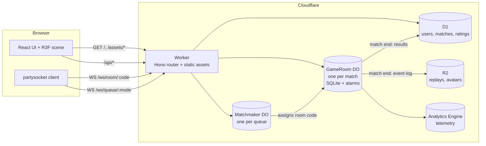
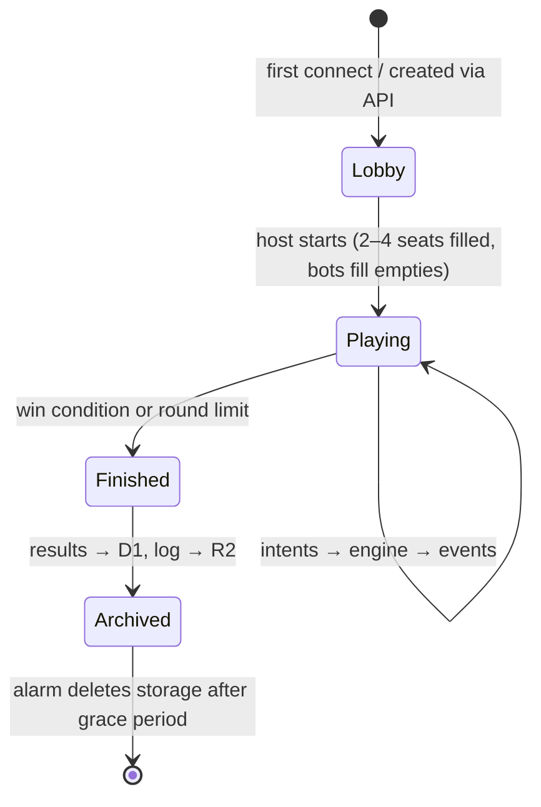
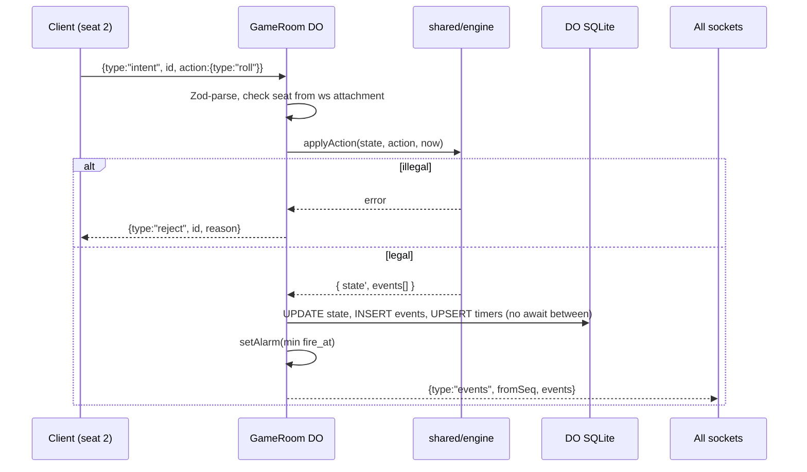

# Architecture

Polytour is one Cloudflare Worker that serves the web client, an HTTP API, and
WebSocket upgrades. Each live match is a `GameRoom` Durable Object: a single-threaded,
strongly consistent actor that owns the game state, the players' sockets, and the
turn timers. Everything that outlives a match (accounts, results, ratings) goes to D1.

## System overview



## Cloudflare products and why

| Product | Role in Polytour | Why this one |
| --- | --- | --- |
| **Workers + Static Assets** | Serves the SPA, `/api/*`, and WS upgrades. One deploy. | Static asset requests are free and globally cached; SPA fallback via `not_found_handling: "single-page-application"`. |
| **Durable Objects (SQLite)** | `GameRoom` per match, `Matchmaker` per queue. | Exactly the "coordination atom" pattern: single-threaded, strongly consistent state + WebSockets in one place. |
| **DO WebSocket Hibernation** | All player connections. | Turn-based games are idle most of the time; hibernation keeps sockets open while the DO is evicted, so idle rooms cost almost nothing. |
| **DO Alarms** | Turn deadlines, disconnect grace, bot moves, room cleanup. | Durable timers that survive eviction; `setTimeout` would pin the DO in memory. |
| **D1** | Users, match history, ratings, cosmetics/inventory. | Relational queries across matches (leaderboards, profile history). |
| **R2** | Compressed match event logs (replays), user avatars, oversized assets. | Cheap blob storage, no egress fees. |
| **Analytics Engine** | Game telemetry: turn durations, abandon rate, money curves, win condition distribution. | High-cardinality events written straight from the DO; queryable with SQL for balancing. |
| **Turnstile** | Guest account creation and room creation. | Stops bot farms without CAPTCHAs for real users. |
| **Workers Rate Limiting binding** | `/api/*` and WS connect attempts. | Cheap abuse control at the edge. |

Not needed at launch: KV (no read-heavy global config yet), Queues (post-match work
fits in the DO's alarm), Workflows, Workers AI (bots are heuristic and run in the DO).
Add them only when a concrete requirement appears.

## Routing

`wrangler.jsonc` (sketch — fill in at scaffold time):

```jsonc
{
  "$schema": "./node_modules/wrangler/config-schema.json",
  "name": "polytour",
  "main": "./src/worker/index.ts",
  "compatibility_date": "<scaffold date>",
  "assets": {
    "not_found_handling": "single-page-application",
    "run_worker_first": ["/api/*", "/ws/*"]
  },
  "durable_objects": {
    "bindings": [
      { "name": "GAME_ROOM", "class_name": "GameRoom" },
      { "name": "MATCHMAKER", "class_name": "Matchmaker" }
    ]
  },
  "migrations": [{ "tag": "v1", "new_sqlite_classes": ["GameRoom", "Matchmaker"] }],
  "d1_databases": [{ "binding": "DB", "database_name": "polytour", "database_id": "<id>" }],
  "r2_buckets": [{ "binding": "REPLAYS", "bucket_name": "polytour-replays" }],
  "analytics_engine_datasets": [{ "binding": "TELEMETRY", "dataset": "polytour_events" }],
  "observability": { "enabled": true }
}
```

| Route | Handler |
| --- | --- |
| `GET /*` (non-API) | Static assets / SPA shell (Worker not invoked) |
| `POST /api/auth/guest` | Verify Turnstile, create guest user in D1, set signed session cookie |
| `GET /api/me` | Current user profile |
| `POST /api/rooms` | Create private room → returns 6-char room code |
| `GET /api/leaderboard` | Top ratings from D1 (cache with Workers Cache) |
| `GET /api/matches/:id/replay` | Stream event log from R2 |
| `GET /ws/room/:code` | Authenticate cookie → `env.GAME_ROOM.getByName(code).fetch(req)` |
| `GET /ws/queue/:mode` | Authenticate → `env.MATCHMAKER.getByName(mode).fetch(req)` |

The Worker authenticates **before** forwarding a WS upgrade and passes the verified
`userId` to the DO in a header it sets itself (strip any incoming copy of that header first).

## GameRoom Durable Object

### Lifecycle



### Storage (DO SQLite)

```sql
CREATE TABLE IF NOT EXISTS meta    (k TEXT PRIMARY KEY, v TEXT NOT NULL);         -- phase, roomCode, createdAt, config
CREATE TABLE IF NOT EXISTS seats   (seat INTEGER PRIMARY KEY, user_id TEXT, is_bot INTEGER, connected INTEGER);
CREATE TABLE IF NOT EXISTS state   (id INTEGER PRIMARY KEY CHECK (id = 1), seq INTEGER NOT NULL, json TEXT NOT NULL);
CREATE TABLE IF NOT EXISTS events  (seq INTEGER PRIMARY KEY, json TEXT NOT NULL); -- append-only log
CREATE TABLE IF NOT EXISTS timers  (kind TEXT PRIMARY KEY, fire_at INTEGER NOT NULL, payload TEXT);
```

- `state` holds the full engine state (including PRNG state) as of `seq`.
- `events` is the append-only log. It powers reconnect catch-up and replays.
- `timers` works around "one alarm per DO": after any change, set the alarm to
  `MIN(fire_at)`. The `alarm()` handler processes every due timer, then re-arms.

### Handling an intent



Per-player redaction: events are broadcast identically to everyone *unless* an
event carries private data (none planned in v1 — card draws are public). If hidden
info is added later, redact per socket using the seat in the attachment.

### Timers and disconnects

| Timer | Fires | Effect |
| --- | --- | --- |
| `turn` | `now + turnSeconds + animationBudget(events)` | Engine applies the default action (auto-roll, decline purchase, auto-sell cheapest to cover debt). |
| `grace:<seat>` | 60 s after socket close | Seat becomes bot-controlled until the player reconnects. |
| `bot` | 0.8–1.5 s after a bot's turn starts | Bot picks an action via `shared/engine/bot`. |
| `cleanup` | 10 min after `Finished` | `deleteAll()` storage. |

`animationBudget` is computed from the events (e.g. 350 ms per tile moved, 1.2 s per
purchase) so a slow animation never eats a player's decision time.

### Reconnect

The client keeps `lastSeq`. On connect it sends `{type:"sync", lastSeq}`:
- If `lastSeq` is within the last 500 events → replay `events WHERE seq > lastSeq`.
- Otherwise → send a full snapshot; the client snaps `viewState` to it (no animation).

## Matchmaker Durable Object

One instance per queue, e.g. `getByName("quick-4p")`. Holds hibernatable sockets of
waiting players, groups them by rating band (widening over time via a timer), then:
1. Generates a room code, calls `env.GAME_ROOM.getByName(code).init(seats, config)` over RPC.
2. Sends each waiting socket `{type:"matched", roomCode}` and closes it.

If a single queue ever becomes a bottleneck, shard by region or rating band
(`quick-4p:eu`, `quick-4p:na`). Pass a `locationHint` when creating rooms for a
regional queue so the DO lives near its players.

## Auth

- **v1: guest-first.** `POST /api/auth/guest` (Turnstile-protected) creates a user
  row and sets an `HttpOnly; Secure; SameSite=Lax` cookie holding a signed session
  token (HMAC via Web Crypto, secret from `wrangler secret`). No passwords stored.
- **v2: account linking.** OAuth (Google, Discord, Apple) to upgrade a guest to a
  permanent account (Better Auth with the D1 adapter, or Arctic for bare OAuth).
- WebSocket auth rides on the same cookie (sent on the upgrade request, same origin).

## D1 schema (initial)

```sql
users         (id TEXT PK, display_name TEXT, avatar TEXT, created_at INTEGER, is_guest INTEGER)
matches       (id TEXT PK, room_code TEXT, mode TEXT, started_at INTEGER, ended_at INTEGER,
               win_condition TEXT, rounds INTEGER, replay_key TEXT)
match_players (match_id TEXT, user_id TEXT, seat INTEGER, placement INTEGER,
               final_net_worth INTEGER, rating_delta INTEGER, PRIMARY KEY (match_id, seat))
ratings       (user_id TEXT, mode TEXT, rating INTEGER, games INTEGER, PRIMARY KEY (user_id, mode))
```

Managed with Drizzle schema + `wrangler d1 migrations`. Leaderboard queries are
cached for 60 s with Workers Cache.

## Security & abuse checklist

- Validate every inbound message with Zod; drop sockets that send malformed frames repeatedly.
- Cap message size (e.g. 4 KB) and rate (e.g. 20 msgs/s per socket) in the DO.
- Chat: length limit, rate limit, profanity filter, per-player mute. Emotes preferred over free text for quick-match.
- Room codes: 6 chars from an unambiguous alphabet (no 0/O/1/I), ~1B combinations; rate-limit join attempts.
- Never expose the PRNG seed, other players' session tokens, or internal user ids beyond what the UI needs.

## Cost model (rough)

A match is ~20 minutes, 4 sockets, a few hundred messages. With hibernation the DO
is billed for active wall-clock time handling messages and alarms, not the whole 20
minutes. Static assets are free. Check current pricing at
https://developers.cloudflare.com/durable-objects/platform/pricing/ before launch and
run a load test (`tools/sim` can drive fake clients) to measure real cost per match.
