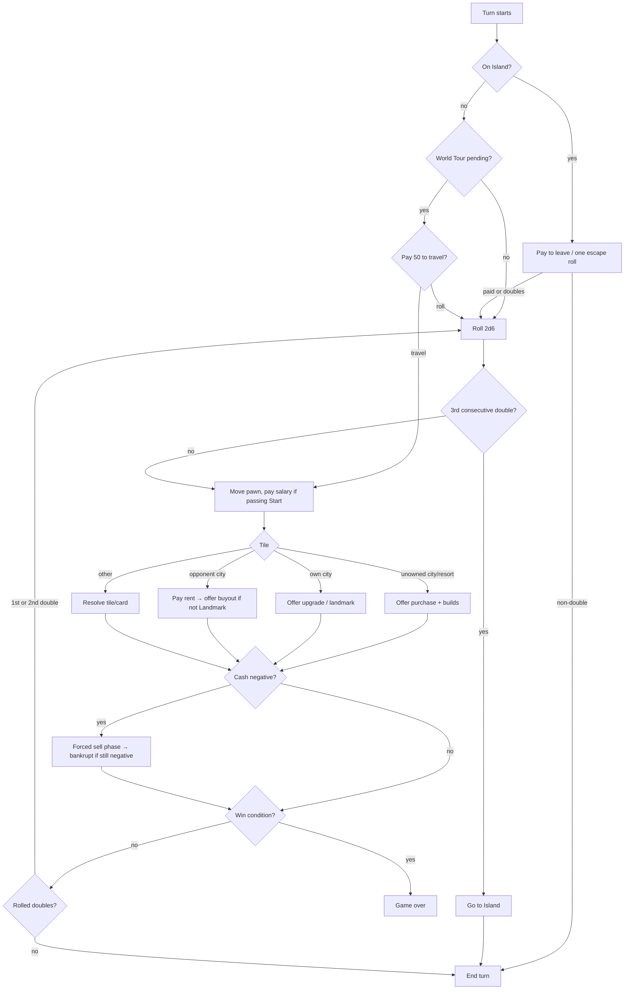

# Game design (rules v0.1)

Polytour is a fast, aggressive property game for 2–4 players. Compared to classic
Monopoly: a smaller board (32 tiles), bigger rents, **buyouts** (you can take an
opponent's city), several **instant-win monopolies**, and a round limit so a match
lasts ~20 minutes.

All numbers here are **starting values**. They live in `src/shared/board/` as config
and get tuned with the simulator (`pnpm sim`) — never hard-code them in logic.

## Design pillars and v1 boundaries

- **Fast, decisive, and legible.** A player should have one meaningful decision at a
  time, and a match must finish inside the round limit without a stalemate rule.
- **Luck creates a problem; choices solve it.** Dice and cards create uncertainty,
  while buying, building, buyouts, and positioning decide the result.
- **No pay-to-win.** Match rules, starting resources, RNG, and available decisions
  are identical for every seat. Cosmetic items may never affect a match.
- **No negotiated trades in v1.** Direct player-to-player offers are intentionally
  out of scope: they slow a 20-minute match, are difficult to time out fairly, and
  make bots much weaker. Buyouts are the fast, public property-transfer mechanic.

The server owns turn order, deck order, and all random draws. The rules below are
written to be deterministic: when several legal targets are otherwise equivalent,
the lowest tile index wins the tie.

## Match setup, laps, and rounds

1. The server shuffles occupied seats with the match PRNG to create `turnOrder`.
   Every player starts on Start with 1,500 cash, no property, no cards, and zero
   completed laps. The first seat in `turnOrder` starts round 1.
2. A **lap** is a clockwise crossing from tile 31 to tile 0. Crossing it immediately
   pays the Start salary and increments that player's lap count. Landing on Start
   also pays salary, but does not add a second lap. Backward movement never pays
   Start salary; World Tour pays it only when its clockwise travel path crosses Start.
3. A **round** ends when every non-bankrupt seat that was still in `turnOrder` at
   the start of that round has completed one turn. Extra rolls from doubles remain
   part of that same turn. Bankrupt seats are skipped thereafter.
4. The round-limit comparison happens only after round 20 completes and no instant
   win has already been resolved on that final turn.

> Mechanics are not protected by copyright, but names and art are trademarks. Board
> theme, city names, card names, and visuals must be our own.

## Board (32 tiles)

Corners at 0, 8, 16, 24. Each side has 7 tiles between corners. Prices rise clockwise.

| # | Side 1 | # | Side 2 | # | Side 3 | # | Side 4 |
| --- | --- | --- | --- | --- | --- | --- | --- |
| 0 | **Start** | 8 | **Island** | 16 | **Championship** | 24 | **World Tour** |
| 1 | A1 | 9 | C1 | 17 | E1 | 25 | G1 |
| 2 | A2 | 10 | C2 | 18 | E2 | 26 | G2 |
| 3 | Chance | 11 | C3 | 19 | Chance | 27 | G3 |
| 4 | B1 | 12 | Resort 2 | 20 | E3 | 28 | Resort 4 |
| 5 | Resort 1 | 13 | D1 | 21 | Resort 3 | 29 | Tax |
| 6 | B2 | 14 | Chance | 22 | F1 | 30 | H1 |
| 7 | B3 | 15 | D2 | 23 | F2 | 31 | H2 |

8 countries (A–H), 20 cities, 4 resorts, 3 Chance, 1 Tax.

## Economy (starting values)

| Parameter | Value |
| --- | --- |
| Starting cash | 1,500 |
| Salary for passing/landing on Start | 200 |
| Players | 2–4 (bots fill empty seats) |
| Round limit | 20 rounds (then highest net worth wins) |
| Sell-back to bank | 50% of invested value |
| Buyout price | 2× invested value (paid to owner) |

**Country land prices:** A 60 · B 90 · C 120 · D 150 · E 180 · F 210 · G 240 · H 280

**Build levels** (cost and rent are multiples of the land price `L`):

| Level | Name | Build cost | Rent | Notes |
| --- | --- | --- | --- | --- |
| 0 | Land | 1.0 × L | 0.2 × L | |
| 1 | House | 0.5 × L | 0.6 × L | |
| 2 | Villa | 0.5 × L | 1.4 × L | |
| 3 | Hotel | 1.0 × L | 2.8 × L | Unlocked after your first lap |
| 4 | Landmark | 1.5 × L | 4.0 × L | Only on your own city when you land on it at Hotel; **cannot be bought out** |

`invested value` is the sum of the original land and upgrade costs paid for a
property; it never includes rent, tax, Championship effects, or a prior buyout
price. A property at Villa, for example, has invested value `2.0 × L`.

On an unowned city, the active player may decline or buy it at any level from Land
through their current unlock cap, paying every intervening cost in one transaction.
On their own city, they may decline or raise it to any higher unlocked level in one
transaction. House and Villa are unlocked from the start; Hotel unlocks after that
player completes their first lap. Landmark is only available when that player lands
on their own Hotel. An action is legal only when its full cost leaves the buyer with
cash of at least zero.

Owning every city of a country doubles the base rent of that country's Land through
Hotel properties. It does not affect Landmark rent. Championship is a separate
modifier (defined below), and the two modifiers never multiply each other: apply
whichever single modifier is larger.

**Resorts:** price 200, no building. Rent by resorts owned: 1 → 50, 2 → 100, 3 → 200, 4 → instant win.

## Corners and special tiles

- **Start:** collect salary when passing or landing.
- **Island:** landing here, a "go to Island" effect, or a third consecutive double
  sends the pawn to tile 8 with `islandTurns = 0`; it does not pass Start or resolve
  Island again. At the start of each trapped turn, choose to pay 100 and roll
  normally, or make one escape roll. A double releases the pawn and its dice move it
  normally; a non-double increments `islandTurns` and ends the turn without moving.
  At `islandTurns = 2`, the player is released and makes the next roll normally for
  free. Escape rolls never grant an extra roll.
- **Championship:** if the active player owns at least one non-Landmark city, they
  must select a host on landing here. A newly selected host has a ×2 Championship
  modifier. Selecting the current host again increases its modifier by ×1, to a
  maximum of ×5; selecting a different host resets the modifier to ×2. A host that
  changes owner is cleared. Landmark cities cannot host. Rent uses the larger of the
  Championship and full-country multiplier, never both.
- **World Tour:** landing here creates a one-turn option for that player. At the
  start of their next non-Island turn, they may pay 50 to travel clockwise to any
  other tile, resolving the destination normally; otherwise they roll normally.
  The option expires after that choice. A World Tour move neither counts as a dice
  roll nor creates a doubles bonus.
- **Tax:** pay 10% of your total invested property value, rounded up (minimum 50).
- **Chance:** draw from a 16-card deck. When its draw pile is empty, shuffle the
  discard pile to make the next draw pile; held keep cards remain unavailable.

### Payment, rent, buyout, and insolvency

1. Resolve each mandatory payment in full before offering an optional action. Rent
   is the property's current base rent with its applicable one modifier; resorts use
   the resort-rent table and have no modifier.
2. After paying rent on an opponent's non-Landmark city, the visitor may buy it out
   once. A buyout costs `2 × invested value`, paid directly to the current owner.
   The city, its level, and its invested value then transfer to the buyer. It is
   legal only if the buyer can pay without going negative. A buyout never includes a
   Championship host; ownership transfer clears the host before monopoly checks.
3. Cash may become negative only after a mandatory payment. This immediately opens
   a forced-sell phase. The debtor may sell any owned cities or resorts to the bank;
   each sale returns 50% of that property's invested value and resets it to unowned
   Land. Selling a Championship host also clears that host. They may sell in any
   order until solvent, then continue the interrupted resolution.
4. If no properties remain and cash is still negative, the player is bankrupt. Their
   remaining cash is set to zero, any remaining property is returned to the bank,
   their held keep-cards are discarded, and they are removed from turn order. The
   creditor is recorded for presentation only; it receives no extra property or
   payment. This is deliberately simple and prevents debt cascades from making
   games unwinnable.

## Turn flow



## Win conditions and standings

1. **Last standing** — every other player is bankrupt.
2. **Triple Monopoly** — own every city of any 3 countries.
3. **Line Monopoly** — own every city and resort on one side of the board.
4. **Resort Monopoly** — own all 4 resorts.
5. **Round limit** — after round 20, highest net worth (cash + invested value) wins.

Check instant wins after an atomic property transfer and after any forced-sell or
bankruptcy phase has completed, never while a mandatory payment or decision is
pending. The first applicable instant condition ends the game immediately. A line
contains every city and resort strictly between its two corner tiles; corners,
Chance, and Tax never count toward line ownership.

At the round limit, rank players by net worth, then cash, then number of resorts,
then earliest position in the randomized `turnOrder`. This always produces one
winner. Instant wins are the dramatic core: they force players to buy out opponents'
properties to *block* a monopoly, which is where the tension comes from.

## Chance deck (16 cards)

| Card | Effect | Keep? |
| --- | --- | --- |
| Grand Tour | Advance to Start, collect salary | |
| Stranded | Go to Island | |
| Jet Set | Move to World Tour | |
| Stadium Call | Move to Championship | |
| Windfall | Collect 150 | |
| Parking Fine | Pay 100 | |
| Birthday | Collect 50 from every other non-bankrupt player | |
| Audit | Pay 10% of your cash, rounded up | |
| Guardian Angel | Cancel one rent payment | ✅ |
| Coupon | Halve your next rent payment | ✅ |
| Earthquake | Downgrade one opponent building by 1 level (not Landmarks) | |
| Land Swap | Choose an opponent city; exchange it with your eligible city of lowest land price (not Landmarks) | |
| Detour | Move back 3 tiles | |
| Contractor | Upgrade one of your cities by 1 level for free | |
| Jailbreak | Everyone on the Island is released | |
| Charity | Give 100 to the poorest player | |

### Chance resolution details

- Drawn, non-keep cards resolve immediately, then enter the discard pile. Keep cards
  leave the deck until used; a player can hold at most one Guardian Angel and one
  Coupon. When used, they enter the discard pile. When the draw pile is empty, its
  discard pile is shuffled to replenish it; held cards remain out of that shuffle.
- A movement card moves and resolves its destination as though the pawn landed there.
  It cannot grant a doubles roll. Grand Tour moves directly to Start and pays its
  salary once; Detour moves counter-clockwise and never pays Start; Stranded sends
  the pawn to Island using the Island rule.
- Guardian Angel is offered after a rent amount is known and before it is paid; it
  reduces that rent to zero. Coupon is offered at the same time and halves the rent,
  rounded up. At most one of these cards may be used for a single rent payment.
- Earthquake targets an opponent's House, Villa, or Hotel. Land Swap targets an
  opponent non-Landmark city whose land price is no greater than the drawer's
  cheapest eligible non-Landmark city; the engine exchanges it with that cheapest
  city. This preserves a single-tile target decision. Any Championship host involved
  in a swap is cleared.
- Contractor targets one of the drawer's non-Landmark cities and raises it exactly
  one legal level for free. It cannot create a Landmark. Jailbreak clears Island
  status without moving pawns.
- Birthday payments resolve one payer at a time in `turnOrder`, and each payer may
  enter forced selling before the next payer is charged. Charity chooses the
  non-bankrupt player with the lowest cash, excluding the drawer; ties use earliest
  position in `turnOrder`. If no other player remains, it has no effect.

"Keep" cards are held as described above; the engine prompts to use them only when
they are legal and relevant.

## Dice

- 2d6 from the server's seeded PRNG. Outside Island, a double grants another roll
  after the current landing is fully resolved. A third consecutive double sends the
  player to Island instead of moving; the counter resets whenever the turn ends.
- **Experimental (Phase 5): power gauge.** Hold-and-release a gauge that biases the
  roll toward low (2–6), mid (5–9) or high (8–12) totals. Server applies a weighted
  distribution — the client only sends which band the gauge stopped in. Ship only if
  playtests show it adds skill without feeling rigged.

## Timers (defaults)

| Decision | Time | Timeout default |
| --- | --- | --- |
| Roll | 10 s | Auto-roll |
| Buy / build / buyout | 15 s | Decline |
| Choose host / travel target / card target | 15 s | Deterministic legal default |
| Forced sell | 30 s | Sell cheapest properties until solvent |

Animation time is added on top of these (see [ARCHITECTURE.md](ARCHITECTURE.md#timers-and-disconnects)).

Timeout defaults must be rules, not an opaque "best move" heuristic: a timed-out
World Tour is declined; a Championship chooses the eligible city with the highest
current rent (then lowest tile). Earthquake targets the opponent city with the
highest current rent, Land Swap takes the highest land-price eligible target, and
Contractor targets the city with the greatest next-level base-rent increase (each
then breaks ties by lowest tile). A timed-out keep-card prompt declines. These
choices are deterministic from public state and are shared by bots and disconnected
human seats. A timed-out forced sell chooses the lowest refund first, then lowest
tile, and repeats until the player is solvent or bankrupt.

## Engine contract

```ts
// src/shared/engine/index.ts
export function createGame(config: GameConfig, seats: SeatInfo[], seed: number): GameState;

export function applyAction(
  state: GameState,
  seat: Seat,
  action: Action,
  ctx: { now: number },
): { ok: true; state: GameState; events: GameEvent[] } | { ok: false; error: RuleError };

export function applyTimeout(state: GameState, ctx: { now: number }): { state: GameState; events: GameEvent[] };

export function legalActions(state: GameState, seat: Seat): Action[]; // drives UI buttons and bots

export function botAction(state: GameState, seat: Seat, difficulty: BotDifficulty): Action;
```

`GameState.pending` describes exactly which seat must decide what (e.g.
`{ kind: "buy", seat: 2, tile: 13, maxLevel: 2 }`), so the UI never guesses whose turn
it is or what's allowed. The engine must expose the legal target set for every
choice; neither the UI nor a bot may infer it from board state.

## Balancing with the simulator

`tools/sim` runs thousands of bot-vs-bot games in Node using the same engine. Track:

- Median and p90 game length (target: 14–18 rounds median, few games hitting the limit).
- Win condition mix (target: bankruptcies and monopolies both common; round-limit wins < 25%).
- Seat advantage (first player win rate should be within ±3% of fair share).
- Termination: no game ever exceeds the round limit or loops.

Change one parameter at a time and commit the sim output alongside the config change.

## Modes (roadmap)

- **Private room** (friends, room code, bots optional) — Phase 4.
- **Quick match** (2p / 4p, matchmaking) — Phase 4.
- **Ranked** (rating per mode) — Phase 7.
- **2v2 teams** (shared win conditions, can't pay rent to teammates) — Phase 7.
