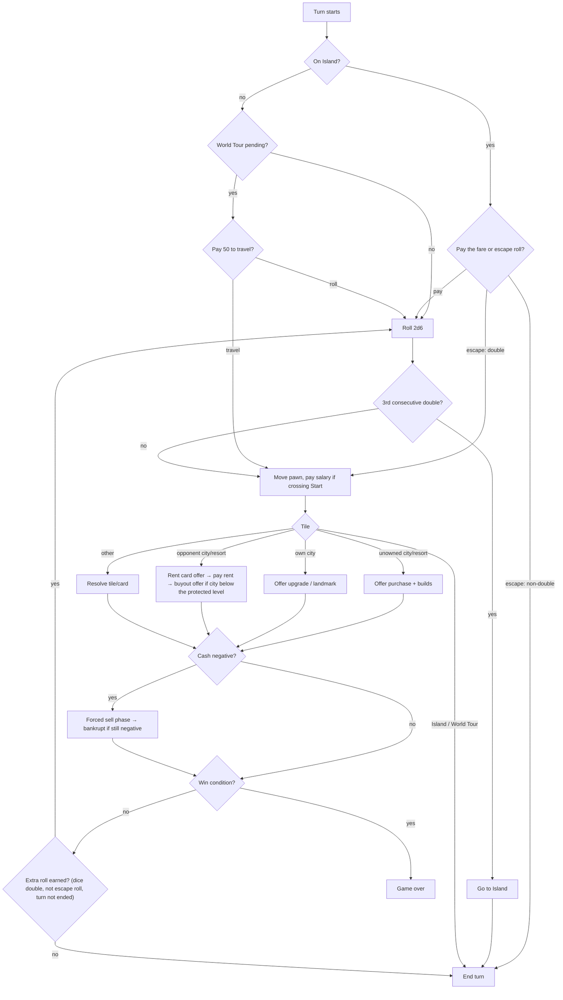

# Game design (new-room rules v0.4; v0.2–v0.3 saved rooms retained)

Polytour is a fast, aggressive property game for two to four players. A room has
four seats; the host can seat server bots in empty places. Compared to classic
Monopoly: a smaller board (32 tiles), bigger rents, **buyouts** (you can take an
opponent's city), several **instant-win monopolies**, and a round limit so a match
has a configurable duration. The user's default is a two-hour maximum; instant
wins and bankruptcies can end a match earlier.

New rooms (rules version 4, `economyRule: "reference"`) follow the reference
game's economy: its rent grid laid side by side on Polytour's board, its fees and
its protections. Rooms saved under rules versions 2–3 keep the original
**prototype** economy; the differences are noted where they apply. All numbers live
in `src/shared/board/` as config and get checked with the simulator (`pnpm sim`) —
never hard-code them in logic. See [REFERENCE_PARITY.md](REFERENCE_PARITY.md) for
the sources and the values that remain interpolated.

## Design pillars and v1 boundaries

- **Fast, decisive, and legible.** A player should have one meaningful decision at a
  time, and a match must finish inside the round limit without a stalemate rule.
- **Luck creates a problem; choices solve it.** Dice and cards create uncertainty,
  while buying, building, buyouts, and positioning decide the result.
- **No pay-to-win.** Match rules, starting resources, RNG, and available decisions
  are identical for every seat. Cosmetic items may never affect a match.
- **No negotiated trades in v1.** Direct player-to-player offers are intentionally
  out of scope: they slow a 20-minute match, are difficult to time out fairly, and
  make bots much weaker. Buyouts are the fast, public property-transfer mechanic.

The server owns turn order, deck order, and all random draws. Live dice come from
fresh server Web Crypto for each new match, without an external beacon wait.
Saved drand matches retain their committed-round mode. The private seeded PRNG is used for deck/turn-order shuffles
and repeatable simulations. See [RANDOMNESS.md](RANDOMNESS.md). The rules below are
written to be deterministic: when several legal targets are otherwise equivalent,
the lowest tile index wins the tie.

## Match setup, laps, and rounds

1. The server shuffles occupied seats with the match PRNG to create `turnOrder`.
   Every player starts on Start with configured cash (default 2,000,000), no property, no cards, and zero
   completed laps. The first seat in `turnOrder` starts round 1.
2. A **lap** is a clockwise crossing from tile 31 to tile 0. Crossing it immediately
   pays the Start salary and increments that player's lap count. Landing on Start by
   clockwise movement *is* that crossing: salary is paid once and one lap is counted,
   never twice. Every clockwise move (dice, World Tour, forward movement cards) pays
   salary exactly when its path crosses Start. Backward movement and "go to Island"
   never pay salary or count a lap.
3. A **round** ends when every non-bankrupt seat that was still in `turnOrder` at
   the start of that round has completed one turn. Extra rolls from doubles remain
   part of that same turn. Bankrupt seats are skipped thereafter.
4. The match's wall-clock deadline is `startedAt + timeLimitMinutes * 60,000`.
   A persistent server alarm ends it at the configured 20/60/120-minute limit.
   Pending landing effects and owed payments settle deterministically without a
   new dice roll before highest net worth wins using the standings tie-breaks.
   A separate round limit
   applies to short tests/simulations; the timed preset uses a 10,000-round safety
   cap. Twenty rounds are not labelled twenty minutes.
5. Three initial festivals are selected by the seeded shuffle by default, among
   cities and resorts (prototype rooms: cities only). Each doubles the rent of its
   tile for the whole match and combines with the other modifiers (see Economy).
   Festival count is configurable.

> Mechanics are not protected by copyright, but names and art are trademarks. Board
> theme, city names, card names, and visuals must be our own.

## Board (32 tiles)

Corners at 0, 8, 16, 24. Each side has 7 tiles between corners. Prices rise clockwise.
Each colour group is one country. Like the classic tour board, a group stays together
on its side; a two-city group may frame a resort or the tax office.

| # | Side 1 | # | Side 2 | # | Side 3 | # | Side 4 |
| --- | --- | --- | --- | --- | --- | --- | --- |
| 0 | **Start** | 8 | **Island** | 16 | **Championship** | 24 | **World Tour** |
| 1 | A1 | 9 | C1 | 17 | E1 | 25 | Resort 4 |
| 2 | A2 | 10 | C2 | 18 | Resort 3 | 26 | G1 |
| 3 | A3 | 11 | C3 | 19 | E2 | 27 | G2 |
| 4 | Resort 1 | 12 | Chance | 20 | Chance | 28 | Chance |
| 5 | B1 | 13 | D1 | 21 | F1 | 29 | H1 |
| 6 | B2 | 14 | Resort 2 | 22 | F2 | 30 | Tax |
| 7 | B3 | 15 | D2 | 23 | F3 | 31 | H2 |

8 countries (A–H), 20 cities, 4 resorts, 3 Chance, 1 Tax. The current names run
France (A), Spain (B), Portugal (C), Italy (D), United Kingdom (E), United States
(F), South Korea (G) and Japan (H); the resorts are the French Riviera, Cyprus,
Dubai and Bali.

## Economy (starting values)

| Parameter | Value |
| --- | --- |
| Starting cash | 2,000,000 (configurable) |
| Salary for passing/landing on Start | 400,000 (configurable) |
| Players | 2–4; empty seats stay empty or take a bot |
| Time limit | 20/60/120 minutes; default 120 (then highest net worth wins) |
| Round limit | 10,000 safety cap; custom tests/simulations use shorter caps |
| Initial festivals | 3 (configurable); cities or resorts with ×2 rent |
| Sell-back to bank | 100% of invested value (prototype: 50%) |
| Buyout price | 2× invested value (paid to owner) |

**Tile-specific economy:** each side of the board is one price tier. A house costs
50,000 / 100,000 / 150,000 / 200,000 on sides 1–4, and land rises from 60,000 on the
first French cities to 400,000 at Tokyo. Each city's land, house, hotel and rent
values are in `src/shared/board/city-economy.ts` (`REFERENCE_CITY_ECONOMY`). The
rents and three-house totals are the reference values; a few totals and the hotel
costs are interpolated (see REFERENCE_PARITY.md). Prototype rooms use
`CITY_ECONOMY`, a linear grid with the same first-city and Tokyo costs.

**Build levels** (each cost is incremental). In the reference grid, bare land earns
little; House I earns `r`, House II about `2r`, House III about `3r`, and the
Hotel `5.5r` to `6r`:

| Level | Name | Build cost | Rent, first city → Tokyo | Notes |
| --- | --- | --- | --- | --- |
| 0 | Land | Tile land price | 2,000 → 50,000 | |
| 1 | House I | Tile house price | 25,000 → 200,000 | |
| 2 | House II | Tile house price | 50,000 → 400,000 | |
| 3 | House III | Tile house price | 75,000 → 600,000 | |
| 4 | Hotel | Tile hotel price | 150,000 → 1,100,000 | Return to owned House III after a completed lap; direct-hotel setting is an exception. **Cannot be bought out or swapped** |

Prototype rooms instead charge 20/60/100/140/280% of the land price `L` and keep a
sixth level, the **Landmark** (1.5 × the hotel cost, rent 4 × L, only on your own
Hotel). There, the Landmark rather than the Hotel cannot be bought out.

`invested value` is a pure function of a tile and current level: the sum
of the build costs of every level from Land up to that level. It does not depend on
what was actually paid, so a free Contractor level counts, a level destroyed by
Earthquake no longer counts, and rent, tax, Championship effects, and buyout prices
never count. The first city's Hotel has invested value 360,000 and Tokyo's 1,500,000.
A resort's invested value is its price.

New rooms freeze `sellBackPercent: 100`: a forced sale returns the land and all
standing construction costs, so a city is not discounted again when covering a
debt. Rent and festival/championship multipliers never inflate its sale value.
This is Polytour tuning, not a verified reference-game liquidation percentage.
Existing v0.2/v0.3 games without the marker retain their 50% refund; preexisting
lobbies freeze `sellBackPercent: 50` when started.

**Integer money and rounding.** Money is always an integer. Coefficients are stored
   in config as integer percentages (e.g. House III rent `140` = 1.4 × L) and evaluated
with integer arithmetic, never floating-point multiplication. Whenever a rule takes
a fraction of an amount, charges to a player round **up** (tax, Audit, Coupon rent)
and payouts to a player round **down** (sell-back refunds).

On an unowned city, the active player may decline or buy it at any level from Land
through their current unlock cap, paying every intervening cost in one transaction.
On their own city, they may decline or raise it to a higher unlocked level in one
transaction. Before their first completed lap, a player can own at most two houses
on a city in reference rooms (three in prototype rooms); after it, a purchase can go
straight to House III. In new rooms, an initial purchase stops at House III even if
the player has completed a lap. An owned city
with fewer than three houses also stops at House III for that landing. Hotel is
available on a later landing when the city already has three houses and the player
has completed at least one lap. The explicit `hotelsDirectly` custom setting bypasses
these hotel prerequisites. In prototype rooms, the Landmark is only available when
that player lands on their own Hotel; reference rooms stop at the Hotel. An action
is legal only when its full cost leaves the buyer with cash of at least zero.

This progression is frozen as `hotelPurchaseRule: "staged-hotels"` for new rooms.
The engine still honours `"legacy-lap"` for simulations, but the server only
creates version-4 rooms and cannot accept an internal rule marker through room
settings. A stale pending choice cannot bypass the new cap. See
[REFERENCE_PARITY.md](REFERENCE_PARITY.md#hotel-progression-and-source-checks--1-october-2026)
for the historical reference evidence and the retained Polytour lap condition.

Three modifiers raise rent: owning every city of a country (×2), a festival (×2)
and the Championship host (×2 and up, defined below). In reference rooms they
**add up**: each adds its bonus to ×1, so a full country with a ×2 championship
pays ×3, and a festival on top pays ×4. The total is capped at ×10. Prototype rooms
apply only the single largest modifier, and none to a Landmark.

> **Prototype balance question.** A prototype Landmark (4.0 × L, no modifier)
> earns less than a Hotel in a full country (5.6 × L) or a hosted Hotel (up to
> 14 × L), so upgrading can lower rent; its only gain is buyout immunity. Reference
> rooms remove the Landmark and protect the Hotel instead.

**Resorts:** price 200,000, no building. Rent per resort by resorts owned:
1 → 25,000, 2 → 50,000, 3 → 100,000 (prototype: 50,000 / 100,000 / 200,000),
4 → instant win. A festival doubles a resort's rent. Resorts are not cities: they
cannot be bought out, hosted, targeted by Earthquake or Land Swap, or upgraded. The
only ways a resort changes hands are buying it while unowned and its owner selling
it to the bank.

## Corners and special tiles

- **Start:** collect salary when passing or landing (once per crossing, see laps above).
- **Island:** landing here, a "go to Island" effect, or a third consecutive double
  sends the pawn to tile 8 with `islandTurns = 0` and **ends the turn immediately**,
  forfeiting any pending doubles roll; it does not pass Start or resolve Island
  again. At the start of each trapped turn, the player chooses one of:
  - **Pay 200,000** (prototype: 100,000; legal only with enough cash): released,
    then a normal roll. A double on that roll grants the usual extra roll.
  - **Escape roll** (free; also the timeout default): a double releases the pawn and
    those same dice move it — there is no second roll, and an escape roll never
    grants an extra roll. A non-double increments `islandTurns` and ends the turn
    without moving.

  After the third failed escape roll (`islandTurns = 3`; prototype: the second)
  the player is released on the spot; their next turn is a normal turn.
- **Championship:** there is one host on the board at a time, shared by all
  players. A player landing here who owns a city may host it in one of their
  cities, or pass. Renewing it on its current city is free; moving it to another
  city costs 50,000. The first championship is ×2, and every hosting adds ×1, up to
  ×10, whether it stays or moves. The championship stays on its city when that city
  is bought out, swapped, sold or returned by a bankruptcy. A timed-out choice
  renews a host the player already owns and otherwise passes.
  *Prototype rooms:* hosting is free and mandatory when the player owns a
  non-Landmark city; a new host restarts at ×2, the same host gains ×1 up to ×5,
  and an upgrade to Landmark, a change of owner or a sale clears the host.
- **World Tour:** landing here **ends the turn immediately**, forfeiting any pending
  doubles roll, and gives that player a travel option for their next turn. At its
  start they may pay 50,000 (legal only with enough cash) to travel clockwise to an
  unowned city or resort, or to one of their own properties when none is free
  (prototype: any other tile), resolving the destination normally; otherwise, or on
  timeout, they roll normally. The option expires after that choice. A World Tour
  move neither counts as a dice roll nor creates a doubles bonus.
- **Tax:** pay 10% of your total invested property value, rounded up. Cash is
  never taxed, so a player with little cash and many buildings can owe more than
  they hold. There is no minimum (prototype: 50,000).
- **Chance:** draw from a 16-card deck. When its draw pile is empty, shuffle the
  discard pile to make the next draw pile; held keep cards remain unavailable.

### Payment, rent, buyout, and insolvency

1. Resolve each mandatory payment in full before offering an optional action. Rent
   is the property's current base rent with its applicable one modifier; resorts use
   the resort-rent table and have no modifier.
2. After paying rent on an opponent's city below the Hotel (prototype: below the
   Landmark), the visitor may buy it out once. A buyout costs
   `2 × invested value`, paid directly to the current owner. The city, its level,
   and its invested value then transfer to the buyer. It is legal only if the buyer
   can pay without going negative. The championship stays on a bought-out city
   (prototype: the transfer clears it). Resorts cannot be bought out. A buyout ends
   that landing's resolution; the buyer can upgrade the city on a later landing.
3. Cash may become negative only after a mandatory payment. This immediately opens
   a forced-sell phase. The debtor may sell any owned cities or resorts to the bank;
   each sale returns 100% of that property's invested value (prototype: 50%,
   rounded down) and resets it to unowned Land. They may sell in any order until
   solvent, then continue the interrupted resolution.
4. If selling every property they own could not bring cash back to zero, the engine
   skips the forced-sell decision and the player is bankrupt immediately; otherwise
   they are bankrupt if cash is still negative once no properties remain. A bankrupt
   player's remaining property is returned to the bank, their held keep-cards are
   discarded, and they are removed from turn order. Their negative balance is set
   to zero: the bank absorbs that amount, and the bankruptcy event records it as
   `writtenOff` so that money conservation (player cash + bank ledger) still holds.
   The creditor is recorded for presentation only; it receives no extra property or
   payment. This is deliberately simple and prevents debt cascades from making
   games unwinnable.

## Turn flow



The turn also ends immediately whenever a card or tile sends the pawn to Island or
lands it on World Tour, even in the middle of a doubles streak.

## Win conditions and standings

1. **Last standing** — every other player is bankrupt.
2. **Triple Monopoly** — own every city of any 3 countries; enabled by default, configurable.
3. **Line Monopoly** — own every city and resort on one side; enabled by default, configurable.
4. **Resort Monopoly** — own all 4 resorts.
5. **Time limit / round cap** — highest net worth (cash + invested value) wins.

Check instant wins after any change of ownership (purchase, buyout, Land Swap, sale)
and after any forced-sell or bankruptcy phase has completed, never while a
mandatory payment or decision is pending. If one change satisfies an instant
condition for several players at once (Land Swap can complete a monopoly on both
sides), the active player wins; otherwise the first such player in `turnOrder`
after the active player. For that winner, the reported win kind is the first
satisfied condition in the list above. A line contains every city and resort
strictly between its two corner tiles; corners, Chance, and Tax never count toward
line ownership.

**Standings** (used for the game-over screen, `placement`, and ratings): the winner
is first. Remaining non-bankrupt players follow, ranked by net worth, then cash,
then number of resorts, then earliest position in the randomized `turnOrder`.
Bankrupt players come last, the most recently eliminated first. At the round limit
the same ordering picks the winner, so every match has exactly one winner.

Instant wins are the dramatic core: they force players to buy out opponents'
properties to *block* a monopoly, which is where the tension comes from.

## Chance deck (16 cards)

| Card | Effect | Keep? |
| --- | --- | --- |
| Grand Tour | Advance to Start, collect salary | |
| Stranded | Go to Island | |
| Jet Set | Move to World Tour | |
| Stadium Call | Move to Championship | |
| Windfall | Collect 150,000 | |
| Parking Fine | Pay 100,000 | |
| Birthday | Collect 50,000 from every other non-bankrupt player | |
| Audit | Pay 10% of your cash, rounded up | |
| Guardian Angel | Cancel one rent payment | ✅ |
| Coupon | Halve one rent payment | ✅ |
| Earthquake | Downgrade one opponent building by 1 level, Hotels included (prototype: not Landmarks) | |
| Land Swap | Optionally choose an opponent city; exchange it with your eligible city of lowest land price (not Hotels; prototype: not Landmarks) | |
| Detour | Move back 3 tiles | |
| Contractor | Upgrade one of your cities by 1 level for free | |
| Jailbreak | Everyone on the Island is released | |
| Charity | Give 100,000 to the poorest player | |

### Chance resolution details

- Drawn, non-keep cards resolve immediately, then enter the discard pile. Keep cards
  leave the deck until used; a player can hold at most one Guardian Angel and one
  Coupon. When used, they enter the discard pile. When the draw pile is empty, its
  discard pile is shuffled to replenish it; held cards remain out of that shuffle.
- A movement card moves and resolves its destination as though the pawn landed there.
  It cannot grant a doubles roll. Grand Tour, Jet Set, and Stadium Call move
  **clockwise** along the board, so the lap rule applies: Grand Tour always pays
  salary once and counts a lap, and Stadium Call drawn on tile 19 goes all the way
  round and does too. (The client may animate a long card move as a teleport; the
  rule still follows the clockwise path.) Detour moves counter-clockwise and never
  pays Start, even when it lands on Start. Jet Set ends the turn on World Tour, and
  Stranded sends the pawn to Island; both use those tiles' rules.
- A card with no legal target (or no legal effect) does nothing and is discarded.
- Guardian Angel is offered after a rent amount is known and before it is paid; it
  reduces that rent to zero. Coupon is offered at the same time and halves the rent,
  rounded up. At most one of these cards may be used for a single rent payment.
- Earthquake targets an opponent's House or Hotel; its invested value drops
  with its level (no refund). Land Swap targets an opponent city below the Hotel
  (prototype: below the Landmark) whose land price is no greater than the drawer's
  cheapest such city; the engine exchanges it with that cheapest city. Each city
  keeps its current level, and therefore its invested value, as it changes owner.
  The drawer may decline the swap. This preserves a single-tile target decision.
  The championship stays on its tile (prototype: a swapped host is cleared).
- Contractor targets one of the drawer's non-Landmark cities and raises it exactly
  one legal level for free (Hotel still requires a completed lap); the free level
  counts toward invested value. It cannot create a Landmark, so a Hotel is not a
  legal target. Jailbreak clears Island status without moving pawns.
- Birthday payments resolve one payer at a time in `turnOrder`, and each payer may
  enter forced selling before the next payer is charged. Charity chooses the
  non-bankrupt player with the lowest cash, excluding the drawer; ties use earliest
  position in `turnOrder`. If no other player remains, it has no effect.

"Keep" cards are held as described above; the engine prompts to use them only when
they are legal and relevant.

## Dice

- Uniform 2d6 from server-injected entropy. A double on a normal roll (including the roll
  after paying to leave Island) grants another roll after the current landing is
  fully resolved, unless that landing ended the turn (Island, World Tour). Island
  escape rolls never grant one. A third consecutive double sends the player to
  Island instead of moving; the counter resets whenever the turn ends.
- **No biased power gauge.** The user explicitly requires genuinely random dice.
  Holding a button, account history, spending, cosmetics, or bot difficulty must
  never change the dice distribution. Any future throwing gesture is cosmetic.

## Timers (defaults)

| Decision | Time | Timeout default |
| --- | --- | --- |
| Roll (incl. Island pay-or-escape, World Tour travel-or-roll) | 10 s | Auto-roll (escape roll on Island, no travel on World Tour) |
| Buy / build / buyout | 15 s | Decline |
| Choose host / card target | 15 s | Deterministic legal default (a paid championship: renew your own host, otherwise pass) |
| Forced sell | 30 s | Sell cheapest properties until solvent |

Animation time is added on top of these. The engine computes each decision's
`deadline` as `now + decision time + animationBudget(events)`, from timing config in
`shared/board` (see [ARCHITECTURE.md](ARCHITECTURE.md#timers-and-disconnects)).

Timeout defaults must be rules, not an opaque "best move" heuristic: a timed-out
World Tour is declined; a Championship chooses the eligible city with the highest
current rent (then lowest tile). Earthquake targets the opponent city with the
highest current rent, and Contractor targets the city with the greatest next-level
base-rent increase (each then breaks ties by lowest tile). A timed-out Land Swap or
keep-card prompt declines. A timed-out forced sell chooses the lowest refund first,
then lowest tile, and repeats until the player is solvent or bankrupt.

These defaults are deterministic from public state and are what `applyTimeout`
applies to a **human** seat whose decision timer expires, whether that player is
connected or inside the disconnect grace period. **Bot** seats never time out: they
act through `botAction` at their difficulty. A disconnected human seat becomes a
bot seat (medium difficulty) when its grace period ends, until the player reconnects.

## Engine contract

```ts
// src/shared/engine/index.ts
// GameState = PublicState + server-only secrets (PRNG state, deck order).
export function createGame(config: GameConfig, seats: SeatInfo[], seed: number, ctx: { now: number }): { state: GameState; events: GameEvent[] };

export function applyAction(
  state: GameState,
  seat: Seat,
  action: Action,
  ctx: { now: number; dice?: readonly [number, number] },
): { ok: true; state: GameState; events: GameEvent[] } | { ok: false; error: RuleError };

export function applyTimeout(state: GameState, ctx: { now: number }): { state: GameState; events: GameEvent[] };

export function applyEvent(state: PublicState, event: GameEvent): PublicState; // pure reducer, used by server and client

export function toPublic(state: GameState): PublicState; // strips secrets; this is the snapshot

export function legalActions(state: PublicState, seat: Seat): Action[]; // drives UI buttons and bots

export function botAction(state: PublicState, seat: Seat, difficulty: BotDifficulty): Action;
```

`applyAction`, `applyTimeout`, and `createGame` decide *what happens* and emit
events; every change to public state is then made by folding those events with
`applyEvent`. The client uses the same reducer to advance `serverState` and the
Director's `viewState`, so both sides agree by construction. Two rules keep that
true:

- **Events are complete.** The reducer never re-derives a rule (it doesn't compute
  rent, laps, or hosts); every public change is carried by some event field.
- **Each money movement appears in exactly one event.** Events with a dedicated
  amount (`SalaryPaid`, `PropertyBought`, `PropertyUpgraded`, `RentPaid`,
  `BoughtOut`, `PropertySold`) are not duplicated by `MoneyTransferred`, which is
  only for movements without their own event (tax, card effects, Island and World
  Tour fees).

`SalaryPaid.amount` is the single accounting input: the reducer adds it to the
player's existing cash and subtracts it from the bank ledger. The redundant
absolute `cash` field remains on the wire for previously opened clients and
stored-event compatibility; the current reducer ignores it. This adopts only the
salary-calculation improvement from PR #12 into the complete prototype engine.

Property test: for any action sequence,
`toPublic(next) == events.reduce(applyEvent, toPublic(prev))`.

`PublicState.pending` describes exactly which seat must decide what (e.g.
`{ kind: "buy", seat: 2, tile: 13, maxLevel: 2 }`), so the UI never guesses whose turn
it is or what's allowed. The engine must expose the legal target set for every
choice; neither the UI nor a bot may infer it from board state.

## Balancing with the simulator

`tools/sim` runs thousands of bot-vs-bot games in Node using the same engine. Track:

- Median and p90 game length (target: 14–18 rounds median, few games hitting the limit).
- Win condition mix (target: bankruptcies and monopolies both common; round-limit wins < 25%).
- Seat advantage (first player win rate should be within ±3% of fair share).
- Termination: no game ever exceeds the round limit or loops.
- Money conservation: player cash + bank ledger (including bankruptcy `writtenOff`)
  is unchanged by every event.
- Per-condition instant-win rates. Resorts can't be bought out, so one resort can
  block Resort Monopoly and its side's Line Monopoly for good; if either rate is
  near zero, revisit that rule.
- Prototype rooms: Landmark build rate and rent earned per Landmark vs.
  full-country or hosted Hotels (see the balance question under Economy).

Change one parameter at a time and commit the sim output alongside the config change.
`pnpm sim -- --rules prototype|reference --rounds N` selects the rule set and round
cap. The reference rules were adopted together at the user's request; their
20-round and 60-round results are in `tools/sim/reference.json`.

## Modes (roadmap)

- **Private room** (friends, room code, bots optional) — implemented in this prototype.
- **Quick match** (2p / 4p, matchmaking) — Phase 4.
- **Ranked** (rating per mode) — Phase 7.
- **2v2 teams** (shared win conditions, can't pay rent to teammates) — Phase 7.
