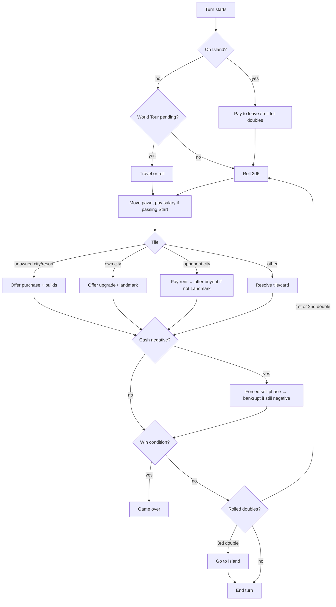

# Game design (rules v0)

Polytour is a fast, aggressive property game for 2–4 players. Compared to classic
Monopoly: a smaller board (32 tiles), bigger rents, **buyouts** (you can take an
opponent's city), several **instant-win monopolies**, and a round limit so a match
lasts ~20 minutes.

All numbers here are **starting values**. They live in `src/shared/board/` as config
and get tuned with the simulator (`pnpm sim`) — never hard-code them in logic.

> Mechanics are not protected by copyright, but names and art are trademarks. Board
> theme, city names, card names, and visuals must be our own.

## Board (32 tiles)

Corners at 0, 8, 16, 24. Each side has 7 tiles between corners. Prices rise clockwise.

| # | Side 1 | # | Side 2 | # | Side 3 | # | Side 4 |
| --- | --- | --- | --- | --- | --- | --- | --- |
| 0 | **Start** | 8 | **Island** | 16 | **Championship** | 24 | **World Tour** |
| 1 | A1 | 9 | C1 | 17 | E1 | 25 | G1 |
| 2 | A2 | 10 | C2 | 18 | E2 | 26 | G2 |
| 3 | Chance | 11 | C3 | 19 | Chance | 27 | G3 |
| 4 | B1 | 12 | Resort 2 | 20 | E3 | 28 | Resort 4 |
| 5 | Resort 1 | 13 | D1 | 21 | Resort 3 | 29 | Tax |
| 6 | B2 | 14 | Chance | 22 | F1 | 30 | H1 |
| 7 | B3 | 15 | D2 | 23 | F2 | 31 | H2 |

8 countries (A–H), 20 cities, 4 resorts, 3 Chance, 1 Tax.

## Economy (starting values)

| Parameter | Value |
| --- | --- |
| Starting cash | 1,500 |
| Salary for passing/landing on Start | 200 |
| Players | 2–4 (bots fill empty seats) |
| Round limit | 20 rounds (then highest net worth wins) |
| Sell-back to bank | 50% of invested value |
| Buyout price | 2× invested value (paid to owner) |

**Country land prices:** A 60 · B 90 · C 120 · D 150 · E 180 · F 210 · G 240 · H 280

**Build levels** (cost and rent are multiples of the land price `L`):

| Level | Name | Build cost | Rent | Notes |
| --- | --- | --- | --- | --- |
| 0 | Land | 1.0 × L | 0.2 × L | |
| 1 | House | 0.5 × L | 0.6 × L | |
| 2 | Villa | 0.5 × L | 1.4 × L | |
| 3 | Hotel | 1.0 × L | 2.8 × L | Unlocked after your first lap |
| 4 | Landmark | 1.5 × L | 4.0 × L | Only on your own city when you land on it at Hotel; **cannot be bought out** |

On an unowned city you may buy land and build up to your unlocked level in one
purchase. Owning a full country doubles that country's rent (not stacked with the
Landmark tier).

**Resorts:** price 200, no building. Rent by resorts owned: 1 → 50, 2 → 100, 3 → 200, 4 → instant win.

## Corners and special tiles

- **Start:** collect salary when passing or landing.
- **Island:** landing (or "go to Island") traps you. Each turn: roll for doubles to
  escape, or pay 100 to leave and roll normally. Released automatically after 3 turns.
- **Championship:** choose one of your cities to host. Its rent ×2. Only one host
  city at a time. Re-hosting the same city raises it by +1× (max ×5).
- **World Tour:** next turn, instead of rolling, you may pay 50 and travel to any
  tile (passing Start pays salary; the destination tile resolves normally).
- **Tax:** pay 10% of your total invested property value (minimum 50).
- **Chance:** draw from a 16-card deck (reshuffled when empty).

## Turn flow



## Win conditions (checked after every state change)

1. **Last standing** — every other player is bankrupt.
2. **Triple Monopoly** — own every city of any 3 countries.
3. **Line Monopoly** — own every city and resort on one side of the board.
4. **Resort Monopoly** — own all 4 resorts.
5. **Round limit** — after the last round, highest net worth (cash + invested value) wins.

Instant wins are the dramatic core: they force players to buy out opponents'
properties to *block* a monopoly, which is where the tension comes from.

## Chance deck (16 cards)

| Card | Effect | Keep? |
| --- | --- | --- |
| Grand Tour | Advance to Start, collect salary | |
| Stranded | Go to Island | |
| Jet Set | Move to World Tour | |
| Stadium Call | Move to Championship | |
| Windfall | Collect 150 | |
| Parking Fine | Pay 100 | |
| Birthday | Collect 50 from every player | |
| Audit | Pay 10% of your cash | |
| Guardian Angel | Cancel one rent payment | ✅ |
| Coupon | Halve your next rent payment | ✅ |
| Earthquake | Downgrade one opponent building by 1 level (not Landmarks) | |
| Land Swap | Swap one of your cities with an opponent city of equal or lower land price (not Landmarks) | |
| Detour | Move back 3 tiles | |
| Contractor | Upgrade one of your cities by 1 level for free | |
| Jailbreak | Everyone on the Island is released | |
| Charity | Give 100 to the poorest player | |

"Keep" cards are held (max 1 of each) and the engine prompts to use them when relevant.

## Dice

- 2d6 from the server's seeded PRNG. Doubles → roll again; 3rd consecutive double → Island.
- **Experimental (Phase 5): power gauge.** Hold-and-release a gauge that biases the
  roll toward low (2–6), mid (5–9) or high (8–12) totals. Server applies a weighted
  distribution — the client only sends which band the gauge stopped in. Ship only if
  playtests show it adds skill without feeling rigged.

## Timers (defaults)

| Decision | Time | Timeout default |
| --- | --- | --- |
| Roll | 10 s | Auto-roll |
| Buy / build / buyout | 15 s | Decline |
| Choose host / travel target / card target | 15 s | Engine picks (best for player) |
| Forced sell | 30 s | Sell cheapest properties until solvent |

Animation time is added on top of these (see [ARCHITECTURE.md](ARCHITECTURE.md#timers-and-disconnects)).

## Engine contract

```ts
// src/shared/engine/index.ts
export function createGame(config: GameConfig, seats: SeatInfo[], seed: number): GameState;

export function applyAction(
  state: GameState,
  seat: Seat,
  action: Action,
  ctx: { now: number },
): { ok: true; state: GameState; events: GameEvent[] } | { ok: false; error: RuleError };

export function applyTimeout(state: GameState, ctx: { now: number }): { state: GameState; events: GameEvent[] };

export function legalActions(state: GameState, seat: Seat): Action[]; // drives UI buttons and bots

export function botAction(state: GameState, seat: Seat, difficulty: BotDifficulty): Action;
```

`GameState.pending` describes exactly which seat must decide what (e.g.
`{ kind: "buy", seat: 2, tile: 13, maxLevel: 2 }`), so the UI never guesses whose turn
it is or what's allowed.

## Balancing with the simulator

`tools/sim` runs thousands of bot-vs-bot games in Node using the same engine. Track:

- Median and p90 game length (target: 14–18 rounds median, few games hitting the limit).
- Win condition mix (target: bankruptcies and monopolies both common; round-limit wins < 25%).
- Seat advantage (first player win rate should be within ±3% of fair share).
- Termination: no game ever exceeds the round limit or loops.

Change one parameter at a time and commit the sim output alongside the config change.

## Modes (roadmap)

- **Private room** (friends, room code, bots optional) — Phase 4.
- **Quick match** (2p / 4p, matchmaking) — Phase 4.
- **Ranked** (rating per mode) — Phase 7.
- **2v2 teams** (shared win conditions, can't pay rent to teammates) — Phase 7.
