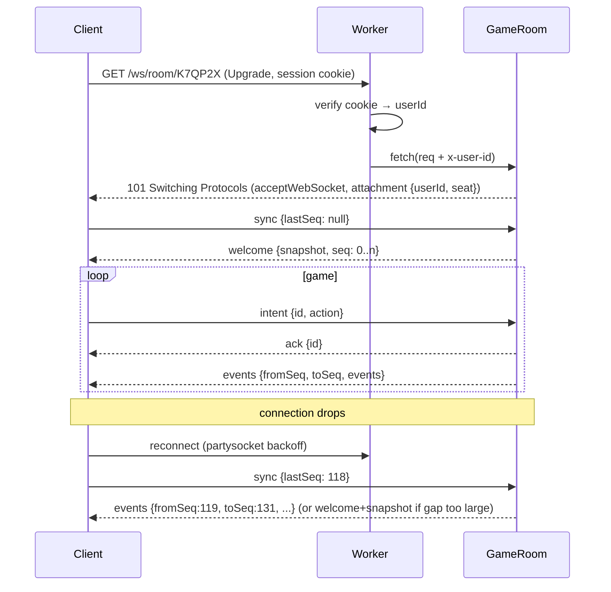

# Client ↔ server protocol

JSON text frames over one WebSocket per player (`/ws/room/:code`). Every message is
a discriminated union on `type`, defined once with Zod in `src/shared/protocol/` and
imported by both client and worker. Binary encoding (e.g. MessagePack) is a later
optimization only if profiling says so — messages are small and infrequent.

## Principles

- **Intents up, events down.** The client asks (`intent`); only the server decides.
- **Monotonic `seq`.** Every event batch has a server sequence number. The client
  applies batches strictly in order and remembers `lastSeq`.
- **Idempotent intents.** Each intent carries a client-generated `id`; the server
  answers with `ack` or `reject` for that `id`, so double-taps and retries are safe.
- **State is recoverable.** Any client can be thrown away and rebuilt from a snapshot.

## Client → server

```ts
type ClientMessage =
  | { type: "sync"; lastSeq: number | null }          // first message after (re)connect
  | { type: "intent"; id: string; action: Action }    // game actions, see below
  | { type: "lobby"; id: string; op: LobbyOp }        // pick seat/color, add bot, start (host only)
  | { type: "emote"; emote: EmoteId }
  | { type: "chat"; text: string }                    // ≤ 120 chars, private rooms only
  | { type: "ping"; t: number };

type Action =
  | { type: "roll"; gauge?: "low" | "mid" | "high" }
  | { type: "buy"; tile: TileId; level: 0 | 1 | 2 | 3 }
  | { type: "build"; tile: TileId; level: 1 | 2 | 3 | 4 }
  | { type: "buyout"; tile: TileId }
  | { type: "decline" }                               // skip current optional decision
  | { type: "useCard"; card: "angel" | "coupon" }
  | { type: "chooseTile"; tile: TileId }              // championship host, travel, card target
  | { type: "leaveIsland"; method: "pay" | "roll" }
  | { type: "sell"; tiles: TileId[] }                 // forced-sell phase
  | { type: "endTurn" };
```

## Server → client

```ts
type ServerMessage =
  | { type: "welcome"; protocolVersion: number; you: { seat: Seat | null; userId: string }; snapshot: Snapshot; seq: number }
  | { type: "events"; fromSeq: number; toSeq: number; events: GameEvent[] }
  | { type: "ack"; id: string }
  | { type: "reject"; id: string; reason: RuleError }
  | { type: "lobby"; lobby: LobbyState }
  | { type: "presence"; seat: Seat; status: "online" | "away" | "bot" }
  | { type: "emote"; seat: Seat; emote: EmoteId }
  | { type: "chat"; seat: Seat; text: string }
  | { type: "pong"; t: number; serverNow: number };   // clock offset for countdown rings
```

`Snapshot` = public `GameState` (no PRNG state, no deck order) + `deadline` for the
current pending decision.

## Game events

Events are small, past-tense facts. Each one maps to exactly one Director handler
on the client (see [ANIMATION.md](ANIMATION.md)).

```ts
type GameEvent =
  | { type: "TurnStarted"; seat: Seat; round: number; deadline: number }
  | { type: "DiceRolled"; seat: Seat; dice: [Die, Die]; isDouble: boolean }
  | { type: "PawnMoved"; seat: Seat; path: TileId[]; mode: "walk" | "teleport" | "backward" }
  | { type: "SalaryPaid"; seat: Seat; amount: number }
  | { type: "DecisionRequested"; pending: Pending; deadline: number }
  | { type: "PropertyBought"; seat: Seat; tile: TileId; level: Level; cost: number }
  | { type: "PropertyUpgraded"; seat: Seat; tile: TileId; from: Level; to: Level; cost: number }
  | { type: "RentPaid"; from: Seat; to: Seat; tile: TileId; amount: number; multiplier: number }
  | { type: "BoughtOut"; buyer: Seat; seller: Seat; tile: TileId; price: number }
  | { type: "CardDrawn"; seat: Seat; card: CardId }
  | { type: "CardUsed"; seat: Seat; card: CardId }
  | { type: "MoneyTransferred"; from: Seat | "bank"; to: Seat | "bank"; amount: number; reason: MoneyReason }
  | { type: "PropertyDowngraded"; tile: TileId; from: Level; to: Level; cause: "earthquake" }
  | { type: "PropertiesSwapped"; a: { seat: Seat; tile: TileId }; b: { seat: Seat; tile: TileId } }
  | { type: "PropertySold"; seat: Seat; tile: TileId; refund: number }
  | { type: "ChampionshipHosted"; seat: Seat; tile: TileId; multiplier: number }
  | { type: "SentToIsland"; seat: Seat; reason: "tile" | "card" | "triple-double" }
  | { type: "LeftIsland"; seat: Seat; method: "pay" | "doubles" | "timeout" | "card" }
  | { type: "PlayerBankrupt"; seat: Seat; creditor: Seat | "bank" }
  | { type: "MonopolyThreat"; seat: Seat; kind: WinKind; missingTiles: TileId[] } // UI warning
  | { type: "GameOver"; winner: Seat | null; kind: WinKind | "round-limit"; standings: Standing[] };
```

`MonopolyThreat` exists purely for drama: the client flashes the missing tiles so
opponents know to block.

## Connection lifecycle



## Limits (enforced in the DO)

| Limit | Value |
| --- | --- |
| Max frame size | 4 KB inbound |
| Rate | 20 msgs/s per socket, burst 40 → close with 1008 on abuse |
| Chat | 120 chars, 1 msg / 2 s |
| Replay window | last 500 events; older gaps get a snapshot |

## Versioning

`welcome` includes `protocolVersion`. On mismatch the client shows "Update
available" and reloads (the service worker fetches the new build). Never deploy a
protocol change that old clients can misread silently — bump the version.
