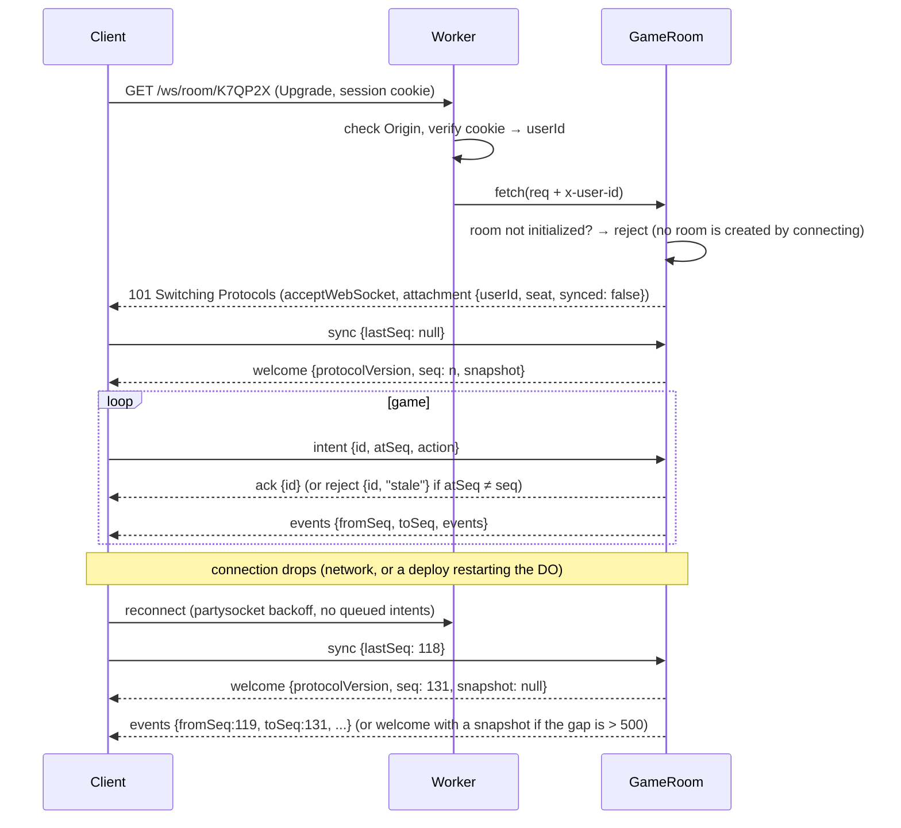

# Client ↔ server protocol

JSON text frames over one WebSocket per player (`/ws/room/:code`). Gameplay and
diagnostic metadata use a discriminated union on `type`, defined once with Zod in
`src/shared/protocol/` and imported by both client and worker. A fixed pair of
transport-only debug ping/pong strings is described below. Binary encoding
(e.g. MessagePack) is a later
optimization only if profiling says so - messages are small and infrequent.

## Implemented playable protocol

`src/shared/protocol/index.ts` is the current executable contract. It supersedes
the older illustrative launch sketches below wherever they differ. The scaffold
debug socket has been removed; `/api/health` remains.

- `GET /api/health` returns `{status: "ok"}` with `Cache-Control: no-store`.
  Adding `?debug=1` includes `diagnostics` (the type in
  `shared/protocol/worker-diagnostics.ts`): configured Worker name, request
  hostname, runtime (`cloudflare`, `local` or `unknown`) and nullable Cloudflare
  entry-point metadata (`colo`, nullable location and region). No room state,
  visitor geography or IP address is returned. Unknown POP codes remain visible
  without a location mapping. This endpoint does not locate the room's DO.

- `POST /api/rooms {name, config?, bots?}` returns 201 and `{roomCode, seat, token}`.
  `bots` (0–3, default 0) seats server bots after the creator; Play asks for three.
  Creation attempts first pass the fixed `room-creation` edge key (120/minute per
  Cloudflare location), then the Matchmaker named `room-admission` (burst 60,
  refill 1/second, at most 1,000 admissions per UTC day in one persisted record).
  No allocation key comes from an IP, cookie or request header. Denials return
  `{error: "rate-limited"}` with HTTP 429, `Retry-After` in seconds and
  `Cache-Control: no-store`; edge denials use 60 seconds, durable denials wait for
  refill or UTC-day reset. Gate failures use the HTTP 503 error path below.
- `POST /api/rooms/:code/join {name}` returns 200 and another capability. An open
  lobby seats the newcomer in the first empty place, otherwise in the first bot's
  place. A locked room, a match in progress (or finished) puts them in the waiting
  list instead and returns `seat: null`. `room-full` (409) means four people already
  hold the places, or six people already wait. Creation limits do not apply to
  joining, reconnecting or moves.
- `POST /api/rooms/:code/leave`, authenticated with `Authorization: Bearer <token>`,
  returns 200 and `{ok:true}` after departure. In a lobby it releases the device's
  seat and local players, revokes its capability and closes all its sockets with
  1008 (`Left room`). The leader passes to the first remaining online person with
  their own device, or the first remaining device if all are offline. Approved,
  connected waiting members take released places. With no devices left the room
  unlocks and admits waiting members; the next person seated becomes leader.
  Waiting members can leave and revoke their membership during any room phase.
  During a match, seated devices retain their places and capability, close all
  their sockets and receive the usual grace for every local player too. Temporary
  socket disconnection keeps lobby seats and leadership for reconnect. The client
  clears credentials only after confirmation (or 401/404 when already unavailable).
- `/api/health`, `/api/rooms/:code/health` and `/api/queues/:mode/health` report
  service liveness directly from the Worker, without a Durable Object lookup.
  Room health validates the code format but does not establish that a room exists.
- The WebSocket uses `Sec-WebSocket-Protocol: polytour, seat.<token>`, selects
  `polytour` in the response, and checks the same Origin before entering the room.
  Capability tokens never appear in public state, lobby, events, or URLs.
- First send `sync {lastSeq:null}` for a snapshot, or a known sequence for replay.
  `welcome {protocolVersion,you,seq,snapshot,lobby,randomness}` always comes first.
  `you` is `{seat, member}`: a seat for a seated device, or `seat: null` and a
  waiting member id. A waiting member receives the lobby and every event (they
  watch the match) but cannot act. When they get a place, the same socket gets a
  fresh `welcome` with its new seat; when the leader returns to the lobby, every
  socket gets a `welcome` with `seq: 0` and no snapshot.
  Replay then sends the contiguous events and any persisted dice proof receipts.
- New servers optionally advertise `roomDebugVersion: 1` in `welcome`. Only then,
  while Debug is open, the client requests `debug-info` once on open/reconnect.
  The socket-specific `room-diagnostics {value}` response is validated by
  `shared/protocol/room-diagnostics.ts`. It contains the requesting socket's saved
  Worker ingress metadata, connected seats' ingress POPs, the `GameRoom` class,
  local SQLite storage and an optional enforced jurisdiction. Exact physical DO
  location is always null: it is not exposed by the runtime. No IP, capability,
  DO identifier or database contents are exposed. Diagnostics are neither game
  events nor broadcasts and do not change the event sequence or game state.
- The fixed strings `polytour-debug-ping-v1` / `polytour-debug-pong-v1` measure
  room WebSocket round-trip time every five seconds while Debug is open, visible
  and online. `setWebSocketAutoResponse` answers without running game JavaScript,
  SQL or alarms. The client handles the exact pong before JSON parsing. Its
  bounded per-socket FIFO retains expired/suspended attempts so a late fixed pong
  cannot be attributed to a new measurement. Socket replacement resets that FIFO.
  Old servers without the capability are never sent these new debug messages.
- The room leader is `lobby.hostSeat`: the creator, until they hand the role on.
  Leader operations are `start {fillBots}`, `settings {config}`, `add-bot {seat}`,
  `remove-bot {seat}` (these four in the lobby only), `transfer-host {seat}`,
  `lock {locked}`, `admit {member}`, `deny {member}`, `replace-bot {member, seat}`
  (during a match) and `return-to-lobby` (during or after a match). Anyone else
  gets `host-only`; a waiting member gets `not-seated` for any operation.
  A room has four places and starts with two to four players. `add-bot` seats a
  server bot on an empty place (`seat-taken` otherwise) and `remove-bot` frees a
  bot's place (`not-a-bot` otherwise). `start {fillBots: true}` seats bots in every
  empty place; `start {fillBots: false}` starts with the occupied places and is
  rejected with `players-required` below two. Each player keeps its lobby seat
  number (colour and corner) in the match, so a smaller match can have gaps such
  as seats 0, 1 and 3. Settings are validated and freeze when the match starts.
- `transfer-host` needs another person with their own device (`not-transferable`
  for the leader's seat, a bot, an empty place or a local player). `lock` holds
  newcomers as `approved: false` members; unlocking admits them all. `admit` seats
  an admitted member at once in a lobby (if a place is free and they are
  connected); `deny` removes a member and closes their sockets with code 4003
  (`Not admitted`), so their capability stops working. `replace-bot` hands a bot's
  place to an admitted member: the engine emits `PlayerControlChanged {seat,
  control: "human", name}` and the seat keeps its money, cities, cards and turn.
  It is refused while dice, a pause vote or an accepted pause are pending.
  `return-to-lobby` discards the match
  (state, event log, commands, timers) and keeps places, bots, settings and the
  frozen rules version; admitted members then take empty places, then bots' places.
- Local players share a device: `add-local {seat, name}` (lobby only, any seated
  device, an empty place) and `remove-local {seat}` (its device or the leader;
  `not-local` for any other seat). `lobby.seats[n].controller` names the device's
  seat. Intents carry an optional `seat` for a local player; a device may only name
  its own seat or its local players (`not-your-seat`). Local players connect,
  disconnect and get their 60-second grace together with their device.
- Protocol version 10 adds the public `PurchaseUnaffordable {seat, tile,
  purchase: "buy" | "buyout", price}` event, which changes no state; older
  clients reload.
- Protocol version 9 adds lobby `bot-difficulty {seat, difficulty}` with
  `difficulty: "easy" | "medium" | "hard"`. Only the leader can change a real
  bot before starting (`host-only`, `not-a-bot`, `game-already-started`). A lobby
  bot reports its effective `botDifficulty`; humans and empty places omit it.
  Explicit seat choices survive room-default changes, compaction, reload and
  return to the lobby. Unselected bots follow the room default until starting;
  each bot's actual level is then frozen in `players[n].botDifficulty`. Human
  replacements clear an individual level and disconnect takeover uses the
  match's frozen default. Missing saved player levels use match config, then
  Medium. Strict validation rejects other levels and seat indices. Older clients
  receive an update or incompatible-response error and must refresh; no state or
  rules version changes.
- Protocol version 9 adds `botDifficulty: "easy" | "medium" | "hard"` to strict
  room settings, lobby config and new match config. Missing settings default to
  `medium`; unmarked saved matches keep Medium decisions. The room leader can
  change this shared default only before starting. Temporary disconnect
  replacements use the frozen match config. Older clients receive an
  update or incompatible-response error and must refresh before resuming. No
  state or rules version changes.
- Protocol version 8 accepts `timeLimitMinutes: null` in room creation and lobby
  settings for unlimited games, or a whole-minute duration of at least 15,
  including durations above 120 (such as 200).
  Decision time accepts whole seconds from 10 to 60. Omitted duration still defaults to 120 minutes.
  Public config preserves null and `matchDeadline` is null; neither time nor
  round limits end these games. Older clients reload before reading this setting.
- Protocol version 7 adds the `PowerCut {seat, tile, untilLap}`,
  `ShieldRaised {seat, tile}`, `ShieldBroken {seat, tile}` (the attacker's seat)
  and `PropertyGiven {seat, to, tile}` events, an optional `shielded: true` and
  `powerCutUntilLap` on a property, an optional `roll` (1-6) on `CardDrawn` for
  Detour and Tailwind, and the lobby's `chanceRule`; older clients reload.
  Protocol version 6 adds the kept `Escape` card and `UseEscapeCard` intent;
  older clients reload before receiving the new held-card value. Version 5 adds `RequestPause`, `VotePause {accept}` and `ResumeGame`,
  public `pause` / `pauseCooldownUntil`, and `PauseChanged` / `GameResumed` events;
  older clients reload. Version 4 adds leaders, waiting members and local players
  (nullable
  `you.seat`, `lobby.locked`, `lobby.waiting`, `seats[n].controller`); older
  clients reload. Version 3 reloaded clients before the regrouped board.
  New rooms freeze rules version 12 with `boardRule: "country"`,
  `economyRule: "reference"`, `hotelPurchaseRule: "staged-hotels"`,
  `sellBackPercent: 100`, `worldTourRule: "free-and-own"`, `resortFestivals: false`,
  `fourResortRent: true`, `buildAfterBuyout: true`, `escapeCard: true`,
  `chanceRule: "reworked"`, `turnOrderRule: "clockwise"` and
  `festivalDistribution: "spread"`. The optional festival-distribution selector
  is server-owned: version-11 and older lobbies use `"random"`, preserving their
  original draw. Existing active snapshots retain their saved festival tiles;
  older snapshots may omit this marker. No new event or protocol version is
  required because clients render the authoritative `festivalTiles`. The optional order
  selector is server-owned: version-10 and older lobbies report `"shuffled"`.
  `GameCreated.state.startingTurnOrder` contains the selected starter first,
  followed by the fixed clockwise cycle. Its initial pending deadline reserves
  the seven-second opening wheel before the ordinary decision window; reconnect
  snapshots do not replay that reveal. Version-9 lobbies report
  `chanceRule: "original"`;
  older rooms also omit or freeze `escapeCard: false` and retain the original
  16-card deck. Version-7 lobbies report both
  booleans as `false`. The optional festival marker preserves version-4/5/6 rooms
  (cities and resorts); missing markers follow the saved economy. Lobbies before
  version 6 report `worldTourRule: "free-first"`. Existing version-2/3 rooms keep the legacy board,
  prototype economy and their original construction, travel and sale rules.
  Lobby snapshots expose their frozen rule markers separately from room settings.
  The strict room-setting schema never accepts internal rule markers; clients
  derive legal construction, travel and sale choices from the shared engine.
- Game actions use PascalCase: `Roll`, `PayIsland`, `UseEscapeCard`, `Travel`, `Decline`, `Buy`,
  `Build`, `Buyout`, `Sell`, `ChooseHost`, `ChooseTarget`, `UseRentCard`. The engine's
  `legalActions` supplies the choices; tile indices are 0..31; reference rooms use levels 0..4 and legacy prototype rooms retain 0..5.
- Each intent has an id and `atSeq`; duplicates, stale state, wrong seats, malformed
  actions, and actions during pending entropy are rejected. Pause actions keep
  these checks and device/local-seat authorization, but may be sent off turn.
  A solo human pauses immediately; several humans require unanimous acceptance
  within 30 seconds while gameplay continues. Permanent bots, bankrupt players
  and waiting members have no vote; disconnected humans still do. A multiplayer
  request starts the shared five-minute cooldown. Rejection or expiry clears the
  vote without stopping play. Any eligible human can resume an accepted pause.
  Gameplay intents while paused get `game-paused`; a request during cooldown
  gets `pause-cooldown`. Votes are outside `legalActions`, which lists turn choices.
  Starting a pause after a spent decision applies its default and rejects the
  stale request; match expiry wins over a new request. Pending dice get
  `randomness-pending` for pause intents and defer vote expiry until that roll
  resolves, preserving the commitment sequence.
- `randomness {status,commitment?,proof?,message?}` carries the persisted roll
  context and resolved receipt. New-room defaults use immediate server Web Crypto:
  no beacon fetch, null round/chain/signature, `verified: false`. Saved drand rooms
  retain their future-round commitment, waiting/error status and verified proof;
  their committed round is unchanged on retry. The wire shapes remain compatible.
- `events {fromSeq,toSeq,events,proofs?}` drives the shared reducer and Director.
  `CardDrawn` records a uniform draw without replacement using fresh server
  `EngineContext.chanceEntropy`, independent of seeded setup. A Detour or
  Tailwind die takes the next entropy word and travels as `roll`. This also handles
  saved decks without a protocol, state schema or rules-version bump. Snapshots
  expose no remaining deck, seed, Chance entropy, hidden resolution queue or
  session token. Replay restores saved draws rather than drawing again.
- Presence derives from live hibernatable sockets. A disconnected human has a
  60-second grace period before server bot takeover; reconnect restores control.
- With no open player sockets, a room sleeps instead of simulating bots. The match
  still ends at its original deadline. An accepted pause retains its decision and
  match budgets: resume shifts both deadlines by the elapsed pause duration.
  Grace still runs; after every eligible human has disconnected for 60 seconds,
  the server resumes the pause and restores unattended match expiry. Reconnect
  within grace restores the persisted pause. Reconnect restores the pending timers
  and
  may therefore encounter an already expired decision or a finished match.
- Create/join failures use JSON errors. `room-storage-limit` (503) identifies the
  verified Cloudflare SQLite free-tier write-limit error; other internal failures
  use `room-service-unavailable` (503). A platform response can still be text or
  HTML, so the client validates all responses before storing seat credentials.
- A WebSocket upgrade is not a successful reconnect: only a valid `welcome`
  enables actions and resets the retry budget. Failed attempts stop after five
  retries. Expired/refused sockets stop immediately; recovery requests coalesce
  until the snapshot arrives and pending command timers clear on disconnect.

The prototype client requests a fresh snapshot on reconnect rather than buffering
offline actions. Chat, emotes, accounts, matchmaking and spectator messages in the
launch sketches below remain unimplemented.

The shared creation budget can be exhausted by abusive callers; it constrains
room allocation rather than guaranteeing DDoS resistance or fair player admission.
Cloudflare's edge counter is local to each location and eventually consistent;
the durable gate enforces the shared admission budget across locations.

## Principles

- **Intents up, events down.** The client asks (`intent`); only the server decides.
- **Monotonic `seq`.** Every game event has its own server sequence number; an
  `events` message carries the contiguous range `fromSeq..toSeq`. The client applies
  events strictly in order and remembers `lastSeq`.
- **Stale intents are rejected, so retries are safe.** Each intent carries a
  client-generated `id` and `atSeq`, the latest event `seq` the client had received
  from the server (its `serverState`, not the lagging `viewState`) when the player
  acted. The server rejects it with `stale` unless `atSeq` equals its current `seq`.
  A double-tap, a retry, or an intent that arrives after the situation moved on
  (timeout, bot takeover) therefore never applies twice or to the wrong decision.
  The server answers each `id` with `ack` or `reject`.
- **No offline queue.** The client never buffers game messages while disconnected
  (`partysocket` option `maxEnqueuedMessages: 0`; action buttons are disabled while
  the socket is not open). `partysocket` would otherwise flush queued messages on
  reconnect *before* the `open` handler sends `sync`.
- **State is recoverable.** Any client can be thrown away and rebuilt from a snapshot.

## Client → server

```ts
type ClientMessage =
  | { type: "sync"; lastSeq: number | null }          // must be the first message after (re)connect
  | { type: "intent"; id: string; atSeq: number; action: Action } // game actions, see below
  | { type: "lobby"; id: string; op: LobbyOp }        // pick seat/color, add bot, start (host only)
  | { type: "emote"; emote: EmoteId }
  | { type: "chat"; text: string }                    // ≤ 120 chars, private rooms only
  | { type: "ping"; t: number };

type Action =
  | { type: "roll" } // historical sketch; executable prototype uses PascalCase Roll
  | { type: "buy"; tile: TileId; level: 0 | 1 | 2 | 3 }
  | { type: "build"; tile: TileId; level: 1 | 2 | 3 | 4 }
  | { type: "buyout"; tile: TileId }
  | { type: "decline" }                               // skip current optional decision
  | { type: "useCard"; card: "angel" | "coupon" }     // only while a rent-card decision is pending
  | { type: "chooseTile"; tile: TileId }              // championship host, travel, card target
  | { type: "leaveIsland"; method: "pay" | "roll" }
  | { type: "sell"; tiles: TileId[] };                // forced-sell phase
```

There is no `endTurn`: a turn ends automatically once no decision is pending and no
extra roll is due. The DO ignores every message on a socket until that socket has
sent `sync` (tracked in its attachment).

## Server → client

```ts
type ServerMessage =
  | { type: "welcome"; protocolVersion: number; you: { seat: Seat | null; userId: string }; seq: number; snapshot: Snapshot | null }
  | { type: "events"; fromSeq: number; toSeq: number; events: GameEvent[] }
  | { type: "ack"; id: string }
  | { type: "reject"; id: string; reason: RuleError | "stale" | "not-your-turn" }
  | { type: "lobby"; lobby: LobbyState }
  | { type: "presence"; seat: Seat; status: "online" | "away" | "bot" }
  | { type: "emote"; seat: Seat; emote: EmoteId }
  | { type: "chat"; seat: Seat; text: string }
  | { type: "pong"; t: number; serverNow: number };   // clock offset for countdown rings
```

`welcome` is **always** the first message the server sends on a socket, on first
connect and on every reconnect, so the client checks `protocolVersion` before it
applies anything. `snapshot` is `null` when the server can replay the gap: the
missing events follow immediately in an `events` message. Current `lobby` and
`presence` messages follow as well.

`Snapshot` = `toPublic(GameState)` (no PRNG state, no deck order), including
`turnOrder` and the current `pending` decision with its `deadline`. Protocol 5
also includes `pause: null | {kind: "vote", requestedBy, requiredSeats,
acceptedSeats, deadline} | {kind: "paused", requestedBy, startedAt}` and the real-time
`pauseCooldownUntil` timestamp. A paused snapshot keeps the stored deadlines;
remaining decision and match budgets are measured at `pause.startedAt` until resume.
`PauseChanged {pause, pauseCooldownUntil}` replaces the pause status.
`GameResumed {seat, pending, matchDeadline}` clears it and supplies the complete
shifted deadlines, so replay and reconnect recover the same remaining time.

## Game events

Events are small, past-tense facts. Each one maps to exactly one Director handler
on the client (see [ANIMATION.md](ANIMATION.md)) and is folded into state by the
shared reducer `applyEvent` (see [GAME_DESIGN.md](GAME_DESIGN.md#engine-contract)).
Events must be complete: the reducer never re-derives a rule. Each money movement
appears in exactly one event, and `MoneyTransferred` is only for movements without
a dedicated event (tax, card effects, Island and World Tour fees). This list is the
v0.1 draft; it grows with the engine, and the reducer property test decides when it
is complete.

The current prototype also emits a legacy absolute `cash` field on `SalaryPaid`
for compatibility with previously opened clients. The shared reducer uses only
`amount` to credit player cash and debit the bank; it does not trust that redundant
balance. Existing valid events replay identically, so this calculation correction
requires no protocol, state or rules version change.

```ts
type InstantWinKind = "triple-monopoly" | "line-monopoly" | "resort-monopoly";
type WinKind = "last-standing" | InstantWinKind | "round-limit";

type GameEvent =
  | { type: "GameStarted"; turnOrder: Seat[]; startingCash: number }
  | { type: "TurnStarted"; seat: Seat; round: number; deadline: number }
  | { type: "DiceRolled"; seat: Seat; dice: [Die, Die]; isDouble: boolean; purpose: "move" | "escape" }
  | { type: "PawnMoved"; seat: Seat; path: TileId[]; mode: "walk" | "teleport" | "backward" }
  | { type: "SalaryPaid"; seat: Seat; amount: number }    // one per Start crossing = one lap
  | { type: "DecisionRequested"; pending: Pending; deadline: number }
  | { type: "PropertyBought"; seat: Seat; tile: TileId; level: Level; cost: number }
  | { type: "PropertyUpgraded"; seat: Seat; tile: TileId; from: Level; to: Level; cost: number } // cost 0 = Contractor
  | { type: "RentPaid"; from: Seat; to: Seat; tile: TileId; amount: number; multiplier: number } // amount after any card
  | { type: "BoughtOut"; buyer: Seat; seller: Seat; tile: TileId; price: number }
  | { type: "CardDrawn"; seat: Seat; card: CardId }
  | { type: "CardUsed"; seat: Seat; card: CardId }
  | { type: "MoneyTransferred"; from: Seat | "bank"; to: Seat | "bank"; amount: number; reason: MoneyReason }
  | { type: "PropertyDowngraded"; tile: TileId; from: Level; to: Level; cause: "earthquake" }
  | { type: "PropertiesSwapped"; a: { seat: Seat; tile: TileId }; b: { seat: Seat; tile: TileId } } // levels move with tiles
  | { type: "PropertySold"; seat: Seat; tile: TileId; refund: number }
  | { type: "ChampionshipHosted"; seat: Seat; tile: TileId; multiplier: number }
  | { type: "ChampionshipCleared"; tile: TileId; reason: "owner-change" | "sold" | "landmark" }
  | { type: "TravelOption"; seat: Seat; available: boolean } // World Tour option granted / used or expired
  | { type: "SentToIsland"; seat: Seat; reason: "tile" | "card" | "triple-double" }
  | { type: "IslandEscapeFailed"; seat: Seat; islandTurns: number }
  | { type: "LeftIsland"; seat: Seat; method: "pay" | "doubles" | "released" | "card" }
  | { type: "PlayerBankrupt"; seat: Seat; creditor: Seat | "bank"; writtenOff: number } // bank absorbs writtenOff
  | { type: "MonopolyThreat"; seat: Seat; kind: InstantWinKind; missingTiles: TileId[] } // UI warning
  | { type: "GameOver"; winner: Seat; kind: WinKind; standings: Standing[] };        // always exactly one winner
```

`MonopolyThreat` exists purely for drama: the client flashes the missing tiles so
opponents know to block. A Guardian Angel or Coupon is offered through a
`DecisionRequested` (`pending.kind: "rentCard"`) before `RentPaid`; if used, a
`CardUsed` precedes the `RentPaid` carrying the reduced amount.
An Escape card is offered only through an Island decision to the player holding
it. `CardUsed {card: "Escape"}` precedes `LeftIsland {method: "card"}` and a normal
roll decision. Escape is never offered as rent protection.

## Connection lifecycle



## Matchmaker (`/ws/queue/:mode`)

A separate, short-lived socket per waiting player:

```ts
type QueueClientMessage = { type: "leave" } | { type: "ping"; t: number };
type QueueServerMessage =
  | { type: "queued"; mode: string; since: number }
  | { type: "matched"; roomCode: string }; // server then closes with 1000; client opens /ws/room/:code
```

## Limits (enforced in the DO)

| Limit | Value |
| --- | --- |
| Max frame size | 4 KB inbound |
| Rate | 20 msgs/s per socket, burst 40 → close with 1008 on abuse |
| Chat | 120 chars, 1 msg / 2 s |
| Replay window | last 500 events; older gaps get a snapshot |

## Versioning

`welcome` includes `protocolVersion`. On mismatch the client shows "Update
available" and reloads (the service worker fetches the new build). Never deploy a
protocol change that old clients can misread silently - bump the version.

Every deploy restarts the Durable Objects and drops their WebSockets, so every open
client reconnects to the new code within seconds. That reconnect's `welcome` is
where a mismatch is caught, which is why `welcome` is never skipped. A deploy also
removes the previous build's hashed chunks: an old client that later lazy-loads the
3D scene gets a failed import. The client listens for Vite's `vite:preloadError` and
reloads (after restoring the room code from the URL).
