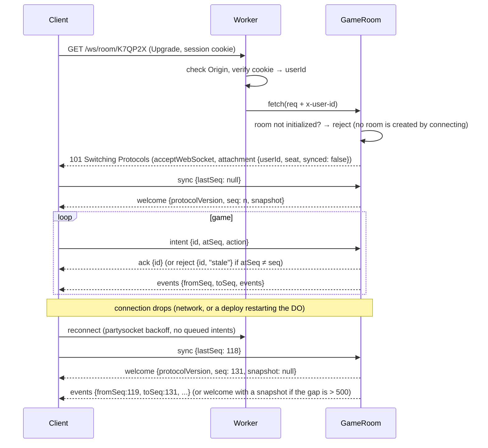

# Client ↔ server protocol

JSON text frames over one WebSocket per player (`/ws/room/:code`). Every message is
a discriminated union on `type`, defined once with Zod in `src/shared/protocol/` and
imported by both client and worker. Binary encoding (e.g. MessagePack) is a later
optimization only if profiling says so — messages are small and infrequent.

## Implemented playable protocol

`src/shared/protocol/index.ts` is the current executable contract. It supersedes
the older illustrative launch sketches below wherever they differ. The scaffold
debug socket has been removed; `/api/health` remains.

- `POST /api/rooms {name, config?}` returns201 and `{roomCode, seat, token}`.
- `POST /api/rooms/:code/join {name}` returns200 and another seat capability.
- The WebSocket uses `Sec-WebSocket-Protocol: polytour, seat.<token>`, selects
  `polytour` in the response, and checks the same Origin before entering the room.
  Capability tokens never appear in public state, lobby, events, or URLs.
- First send `sync {lastSeq:null}` for a snapshot, or a known sequence for replay.
  `welcome {protocolVersion,you,seq,snapshot,lobby,randomness}` always comes first.
  Replay then sends the contiguous events and any persisted dice proof receipts.
- Host lobby operations are `start {fillBots}`, `settings {config}`,
  `add-bot {seat}` and `remove-bot {seat}`. A room has four places and starts with
  two to four players. `add-bot` seats a server bot on an empty place (`seat-taken`
  otherwise) and `remove-bot` frees a bot's place (`not-a-bot` otherwise); joining
  friends take the first empty place. `start {fillBots: true}` seats bots in every
  empty place; `start {fillBots: false}` starts with the occupied places and is
  rejected with `players-required` below two. Each player keeps its lobby seat
  number (colour and corner) in the match, so a smaller match can have gaps such
  as seats 0, 1 and 3. Settings are validated and freeze when the match starts.
- New-room hotel progression is frozen by the server in the optional public config
  marker `hotelPurchaseRule: "staged-hotels"`. Older saves may omit it or use
  `"legacy-lap"`. This is not an accepted room-setting input; clients must derive
  legal construction choices from the engine. This marker leaves action/event
  shapes unchanged.
- New-room sale values are frozen by the server as the optional public config
  marker `sellBackPercent: 100`; older saves may omit it or use `50`. Room creation
  and settings reject this internal marker. Clients quote sales through the shared
  engine so the displayed amount matches the server's frozen rules. Action/event
  shapes stay unchanged, but the protocol version is now 2: older clients hard-code
  50% refunds and must refresh on welcome before presenting new-room sale quotes.
- Game actions use PascalCase: `Roll`, `PayIsland`, `Travel`, `Decline`, `Buy`,
  `Build`, `Buyout`, `Sell`, `ChooseHost`, `ChooseTarget`, `UseRentCard`. The engine's
  `legalActions` supplies the choices; tile indices are0..31 and levels0..5.
- Each intent has an id and `atSeq`; duplicates, stale state, wrong seats, malformed
  actions, and actions during pending entropy are rejected.
- `randomness {status,commitment?,proof?,message?}` carries the persisted roll
  context and resolved receipt. New-room defaults use immediate server Web Crypto:
  no beacon fetch, null round/chain/signature, `verified: false`. Saved drand rooms
  retain their future-round commitment, waiting/error status and verified proof;
  their committed round is unchanged on retry. The wire shapes remain compatible.
- `events {fromSeq,toSeq,events,proofs?}` drives the shared reducer and Director.
  Snapshots expose no deck, seed, hidden resolution queue, or session token.
- Presence derives from live hibernatable sockets. A disconnected human has a
  60-second grace period before server bot takeover; reconnect restores control.
- With no open player sockets, a room sleeps instead of simulating bots. The match
  still ends at its original deadline. Reconnect restores the pending timers and
  may therefore encounter an already expired decision or a finished match.
- Create/join failures use JSON errors. `room-storage-limit` (503) identifies the
  verified Cloudflare SQLite free-tier write-limit error; other internal failures
  use `room-service-unavailable` (503). A platform response can still be text or
  HTML, so the client validates all responses before storing seat credentials.
- A WebSocket upgrade is not a successful reconnect: only a valid `welcome`
  enables actions and resets the retry budget. Failed attempts stop after five
  retries. Expired/refused sockets stop immediately; recovery requests coalesce
  until the snapshot arrives and pending command timers clear on disconnect.

The prototype client requests a fresh snapshot on reconnect rather than buffering
offline actions. Chat, emotes, accounts, matchmaking and spectator messages in the
launch sketches below remain unimplemented.

## Principles

- **Intents up, events down.** The client asks (`intent`); only the server decides.
- **Monotonic `seq`.** Every game event has its own server sequence number; an
  `events` message carries the contiguous range `fromSeq..toSeq`. The client applies
  events strictly in order and remembers `lastSeq`.
- **Stale intents are rejected, so retries are safe.** Each intent carries a
  client-generated `id` and `atSeq`, the latest event `seq` the client had received
  from the server (its `serverState`, not the lagging `viewState`) when the player
  acted. The server rejects it with `stale` unless `atSeq` equals its current `seq`.
  A double-tap, a retry, or an intent that arrives after the situation moved on
  (timeout, bot takeover) therefore never applies twice or to the wrong decision.
  The server answers each `id` with `ack` or `reject`.
- **No offline queue.** The client never buffers game messages while disconnected
  (`partysocket` option `maxEnqueuedMessages: 0`; action buttons are disabled while
  the socket is not open). `partysocket` would otherwise flush queued messages on
  reconnect *before* the `open` handler sends `sync`.
- **State is recoverable.** Any client can be thrown away and rebuilt from a snapshot.

## Client → server

```ts
type ClientMessage =
  | { type: "sync"; lastSeq: number | null }          // must be the first message after (re)connect
  | { type: "intent"; id: string; atSeq: number; action: Action } // game actions, see below
  | { type: "lobby"; id: string; op: LobbyOp }        // pick seat/color, add bot, start (host only)
  | { type: "emote"; emote: EmoteId }
  | { type: "chat"; text: string }                    // ≤ 120 chars, private rooms only
  | { type: "ping"; t: number };

type Action =
  | { type: "roll" } // historical sketch; executable prototype uses PascalCase Roll
  | { type: "buy"; tile: TileId; level: 0 | 1 | 2 | 3 }
  | { type: "build"; tile: TileId; level: 1 | 2 | 3 | 4 }
  | { type: "buyout"; tile: TileId }
  | { type: "decline" }                               // skip current optional decision
  | { type: "useCard"; card: "angel" | "coupon" }     // only while a rent-card decision is pending
  | { type: "chooseTile"; tile: TileId }              // championship host, travel, card target
  | { type: "leaveIsland"; method: "pay" | "roll" }
  | { type: "sell"; tiles: TileId[] };                // forced-sell phase
```

There is no `endTurn`: a turn ends automatically once no decision is pending and no
extra roll is due. The DO ignores every message on a socket until that socket has
sent `sync` (tracked in its attachment).

## Server → client

```ts
type ServerMessage =
  | { type: "welcome"; protocolVersion: number; you: { seat: Seat | null; userId: string }; seq: number; snapshot: Snapshot | null }
  | { type: "events"; fromSeq: number; toSeq: number; events: GameEvent[] }
  | { type: "ack"; id: string }
  | { type: "reject"; id: string; reason: RuleError | "stale" | "not-your-turn" }
  | { type: "lobby"; lobby: LobbyState }
  | { type: "presence"; seat: Seat; status: "online" | "away" | "bot" }
  | { type: "emote"; seat: Seat; emote: EmoteId }
  | { type: "chat"; seat: Seat; text: string }
  | { type: "pong"; t: number; serverNow: number };   // clock offset for countdown rings
```

`welcome` is **always** the first message the server sends on a socket, on first
connect and on every reconnect, so the client checks `protocolVersion` before it
applies anything. `snapshot` is `null` when the server can replay the gap: the
missing events follow immediately in an `events` message. Current `lobby` and
`presence` messages follow as well.

`Snapshot` = `toPublic(GameState)` (no PRNG state, no deck order), including
`turnOrder` and the current `pending` decision with its `deadline`.

## Game events

Events are small, past-tense facts. Each one maps to exactly one Director handler
on the client (see [ANIMATION.md](ANIMATION.md)) and is folded into state by the
shared reducer `applyEvent` (see [GAME_DESIGN.md](GAME_DESIGN.md#engine-contract)).
Events must be complete: the reducer never re-derives a rule. Each money movement
appears in exactly one event, and `MoneyTransferred` is only for movements without
a dedicated event (tax, card effects, Island and World Tour fees). This list is the
v0.1 draft; it grows with the engine, and the reducer property test decides when it
is complete.

The current prototype also emits a legacy absolute `cash` field on `SalaryPaid`
for compatibility with previously opened clients. The shared reducer uses only
`amount` to credit player cash and debit the bank; it does not trust that redundant
balance. Existing valid events replay identically, so this calculation correction
requires no protocol, state or rules version change.

```ts
type InstantWinKind = "triple-monopoly" | "line-monopoly" | "resort-monopoly";
type WinKind = "last-standing" | InstantWinKind | "round-limit";

type GameEvent =
  | { type: "GameStarted"; turnOrder: Seat[]; startingCash: number }
  | { type: "TurnStarted"; seat: Seat; round: number; deadline: number }
  | { type: "DiceRolled"; seat: Seat; dice: [Die, Die]; isDouble: boolean; purpose: "move" | "escape" }
  | { type: "PawnMoved"; seat: Seat; path: TileId[]; mode: "walk" | "teleport" | "backward" }
  | { type: "SalaryPaid"; seat: Seat; amount: number }    // one per Start crossing = one lap
  | { type: "DecisionRequested"; pending: Pending; deadline: number }
  | { type: "PropertyBought"; seat: Seat; tile: TileId; level: Level; cost: number }
  | { type: "PropertyUpgraded"; seat: Seat; tile: TileId; from: Level; to: Level; cost: number } // cost 0 = Contractor
  | { type: "RentPaid"; from: Seat; to: Seat; tile: TileId; amount: number; multiplier: number } // amount after any card
  | { type: "BoughtOut"; buyer: Seat; seller: Seat; tile: TileId; price: number }
  | { type: "CardDrawn"; seat: Seat; card: CardId }
  | { type: "CardUsed"; seat: Seat; card: CardId }
  | { type: "MoneyTransferred"; from: Seat | "bank"; to: Seat | "bank"; amount: number; reason: MoneyReason }
  | { type: "PropertyDowngraded"; tile: TileId; from: Level; to: Level; cause: "earthquake" }
  | { type: "PropertiesSwapped"; a: { seat: Seat; tile: TileId }; b: { seat: Seat; tile: TileId } } // levels move with tiles
  | { type: "PropertySold"; seat: Seat; tile: TileId; refund: number }
  | { type: "ChampionshipHosted"; seat: Seat; tile: TileId; multiplier: number }
  | { type: "ChampionshipCleared"; tile: TileId; reason: "owner-change" | "sold" | "landmark" }
  | { type: "TravelOption"; seat: Seat; available: boolean } // World Tour option granted / used or expired
  | { type: "SentToIsland"; seat: Seat; reason: "tile" | "card" | "triple-double" }
  | { type: "IslandEscapeFailed"; seat: Seat; islandTurns: number }
  | { type: "LeftIsland"; seat: Seat; method: "pay" | "doubles" | "released" | "card" }
  | { type: "PlayerBankrupt"; seat: Seat; creditor: Seat | "bank"; writtenOff: number } // bank absorbs writtenOff
  | { type: "MonopolyThreat"; seat: Seat; kind: InstantWinKind; missingTiles: TileId[] } // UI warning
  | { type: "GameOver"; winner: Seat; kind: WinKind; standings: Standing[] };        // always exactly one winner
```

`MonopolyThreat` exists purely for drama: the client flashes the missing tiles so
opponents know to block. A Guardian Angel or Coupon is offered through a
`DecisionRequested` (`pending.kind: "rentCard"`) before `RentPaid`; if used, a
`CardUsed` precedes the `RentPaid` carrying the reduced amount.

## Connection lifecycle



## Matchmaker (`/ws/queue/:mode`)

A separate, short-lived socket per waiting player:

```ts
type QueueClientMessage = { type: "leave" } | { type: "ping"; t: number };
type QueueServerMessage =
  | { type: "queued"; mode: string; since: number }
  | { type: "matched"; roomCode: string }; // server then closes with 1000; client opens /ws/room/:code
```

## Limits (enforced in the DO)

| Limit | Value |
| --- | --- |
| Max frame size | 4 KB inbound |
| Rate | 20 msgs/s per socket, burst 40 → close with 1008 on abuse |
| Chat | 120 chars, 1 msg / 2 s |
| Replay window | last 500 events; older gaps get a snapshot |

## Versioning

`welcome` includes `protocolVersion`. On mismatch the client shows "Update
available" and reloads (the service worker fetches the new build). Never deploy a
protocol change that old clients can misread silently — bump the version.

Every deploy restarts the Durable Objects and drops their WebSockets, so every open
client reconnects to the new code within seconds. That reconnect's `welcome` is
where a mismatch is caught, which is why `welcome` is never skipped. A deploy also
removes the previous build's hashed chunks: an old client that later lazy-loads the
3D scene gets a failed import. The client listens for Vite's `vite:preloadError` and
reloads (after restoring the room code from the URL).
